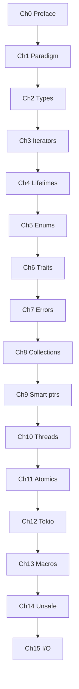

# Table of Contents

**Rust for the Rest of Us** — balanced path: paradigm → systems → automation.

---

## Part I — The Rust paradigm

| Ch | Title | File |
|----|-------|------|
| 0 | [Preface](chapters/00_preface.md) | `chapters/00_preface.md` |
| 1 | [Paradigm shift](chapters/01_paradigm_shift.md) | `chapters/01_paradigm_shift.md` |
| 2 | [Types and expressions](chapters/02_types.md) | `chapters/02_types.md` |
| 3 | [Iterators](chapters/03_iterators.md) | `chapters/03_iterators.md` |
| 4 | [Lifetimes](chapters/04_lifetimes.md) | `chapters/04_lifetimes.md` |
| 5 | [Enums and pattern matching](chapters/05_types_enums_pattern_matching.md) | `chapters/05_types_enums_pattern_matching.md` |
| 6 | [Structs, traits, and generics](chapters/06_structs_traits_generics.md) | `chapters/06_structs_traits_generics.md` |
| 7 | [Errors and testing](chapters/07_errors_and_testing.md) | `chapters/07_errors_and_testing.md` |

## Part II — Systems, concurrency, metaprogramming

| Ch | Title | File |
|----|-------|------|
| 8 | [Collections and iterators](chapters/08_collections_iterators.md) | `chapters/08_collections_iterators.md` |
| 9 | [Smart pointers and modules](chapters/09_smart_pointers_modules.md) | `chapters/09_smart_pointers_modules.md` |
| 10 | [Multithreading](chapters/10_multithreading.md) | `chapters/10_multithreading.md` |
| 11 | [Atomics and lock-free basics](chapters/11_atomics_and_lockfree.md) | `chapters/11_atomics_and_lockfree.md` |
| 12 | [Async Rust and Tokio](chapters/12_async_tokio.md) | `chapters/12_async_tokio.md` |
| 13 | [Metaprogramming](chapters/13_metaprogramming.md) | `chapters/13_metaprogramming.md` |
| 14 | [Unsafe and when to stop](chapters/14_unsafe_and_internals.md) | `chapters/14_unsafe_and_internals.md` |

## Part III — I/O and automation

| Ch | Title | File |
|----|-------|------|
| 15 | [I/O, processes, and bits](chapters/15_io_processes_bits.md) | `chapters/15_io_processes_bits.md` |

## Appendices

| Doc | Purpose |
|-----|---------|
| [AI Prompt Index](appendix/AI_PROMPT_INDEX.md) | **200** Afterparty prompts (**P001–P200**) |
| [Playground Guide](appendix/PLAYGROUND_GUIDE.md) | How to run snippets online vs locally |
| [Java / Python / Rust map](appendix/JAVA_PYTHON_RUST_MAP.md) | One-page mental-model cheat sheet |

**Archive (reference only):** [CHAPTER_01](archive/CHAPTER_01_RUST_BASICS.md) · [CHAPTER_02](archive/CHAPTER_02_AUTOMATION_AND_SYSTEM_PROGRAMMING.md)

---

## Suggested pace

| Part | Chapters | Rough time |
|------|----------|------------|
| I | 0–7 | 12–18 h |
| II | 8–14 | 14–20 h |
| III | 15 | 3–6 h |

Adjust for depth; concurrency chapters reward repetition.

---

## Reading order (mermaid)

