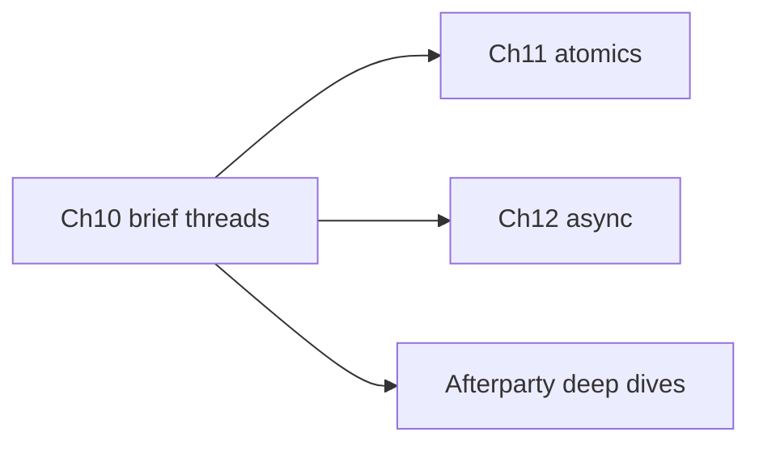

# Chapter 10: Multithreading

## Hook

Python threads fight the GIL for CPU work; Java threads share the heap with locks. Rust threads are **OS threads**, but **safe Rust** prevents many data races at compile time via `Send` and `Sync` — plus channels and mutexes when sharing is real.

## Scope — a brief tour, not 100% of the topic

Multithreading is a **large** field. This chapter is an **introductory ladder** — enough to read real code and spot the main patterns. It is **not** a complete reference.

| This chapter covers | Deferred to See also / Afterparty |
|---------------------|-----------------------------------|
| `thread::spawn`, `join`, `move` | `thread::scope`, detached threads |
| `mpsc` channels | bounded channels, backpressure, worker pools |
| `Arc<Mutex<T>>` | `RwLock`, `Condvar`, `Barrier` |
| `Send` / `Sync` basics | `RefCell` across threads, pinning |
| One automation worker sketch | `rayon`, custom thread pools, cross-process IPC |
| — | Lock-free atomics → [Chapter 11](11_atomics_and_lockfree.md) |
| — | Async concurrency → [Chapter 12](12_async_tokio.md) |

Use **Afterparty** prompts and linked chapters to go deeper. Treat this as **map + first steps**, not the whole territory.



## What multithreading is

A **thread** is an independent call stack scheduled by the OS. Your program can run **multiple threads at once** (or interleaved on one CPU).

| Idea | Plain language |
|------|----------------|
| **Thread** | Its own stack; runs code in parallel with other threads |
| **Why bother** | Overlap **I/O wait** (serial port + network) or parallelize **isolated** work units |
| **Rust twist** | Ownership and borrowing apply **across threads** — the compiler rejects many sharing mistakes that become data races in C++/Java |
| **Two safe patterns** | **Message passing** (`mpsc` channels) or **shared state** (`Arc<Mutex<T>>`) |

```
main thread:  spawn worker ──► worker runs ──► join() waits ──► use result
```

[`Arc`](09_smart_pointers_modules.md) exists largely because threads need **shared ownership** — `Rc` is single-threaded only.

## Examples: elementary → hard

Work through the levels in order. After each snippet: **run it**, then read **what happened**.

### Level 1 — Elementary: spawn and join

```rust
// Playground
use std::thread;
use std::time::Duration;

fn main() {
    let handle = thread::spawn(|| {
        thread::sleep(Duration::from_millis(10));
        42
    });
    println!("joined = {:?}", handle.join());
}
```

**What happened:**

- Main spawns a child thread; child sleeps 10 ms, returns `42`.
- **`joined = Ok(42)`** — `join()` waits for the child and wraps its return value in `Ok`.
- If the child **panics**, `join()` returns **`Err(...)`** (not a normal return) — see [Chapter 7 — panic and unwind](07_errors_and_testing.md#panic-unwind-and-why-it-is-not-result) and Level 6 below.

### Level 2 — Elementary: `move` into the thread

Data used inside the closure must be **owned** or **`'static`**. Usually you **`move`** values into the new thread:

```rust
// Playground
use std::thread;

fn main() {
    let msg = String::from("poll");
    let handle = thread::spawn(move || {
        println!("{msg}");
    });
    handle.join().unwrap();
}
```

**What happened:**

- Prints **`poll`** — the child owns `msg` inside its closure.
- **`move`** transfers ownership from `main` into the thread; `msg` is **not** usable in `main` after spawn.

**Wrong — use `msg` after `move`:**

```rust
// Playground — does not compile
use std::thread;

fn main() {
    let msg = String::from("poll");
    let handle = thread::spawn(move || println!("{msg}"));
    println!("{msg}"); // ERROR: borrow of moved value: `msg`
    handle.join().unwrap();
}
```

Fix: **`msg.clone()`** before spawn if both sides need a copy — that **duplicates the `String` data** on the heap (can be costly for large buffers). Cheaper patterns: pass data back via **`join()`** / a **channel**, or share with **`Arc`** (Level 4) when many threads need the same allocation.

### Level 3 — Medium: `mpsc` channel

**Multi-producer, single-consumer** — send messages instead of sharing mutable state:

```rust
// Playground
use std::sync::mpsc;
use std::thread;

fn main() {
    let (tx, rx) = mpsc::channel();
    thread::spawn(move || {
        tx.send(1).unwrap();
        tx.send(2).unwrap();
    });
    for val in rx {
        println!("got {}", val);
    }
}
```

**What happened:**

- Prints **`got 1`** then **`got 2`** — order preserved (FIFO).
- **`move`** on the closure: **`tx`** ownership moves to the worker; main keeps **`rx`**.
- When all **`tx`** senders are **dropped**, the `for val in rx` loop **ends** — channel closed.
- **Message passing** often beats shared mutable state for work queues and command streams.

### Level 4 — Medium: `Arc<Mutex<T>>` shared counter

When threads must **mutate the same data**, wrap it in **`Mutex`** (exclusive access) and **`Arc`** (shared ownership):

```rust
// Playground
use std::sync::{Arc, Mutex};
use std::thread;

fn main() {
    let counter = Arc::new(Mutex::new(0));
    let mut handles = vec![];

    for _ in 0..4 {
        let c = Arc::clone(&counter);
        handles.push(thread::spawn(move || {
            let mut n = c.lock().unwrap();
            *n += 1;
        }));
    }
    for h in handles {
        h.join().unwrap();
    }
    println!("count = {}", *counter.lock().unwrap());
}
```

| Piece | Role |
|-------|------|
| `Arc` | Reference-counted handle — many threads hold the **same** allocation |
| `Mutex` | Only one thread mutates inner `T` at a time |
| `lock().unwrap()` | Block until lock acquired; **panic** if mutex is **poisoned** |
| `Arc::clone(&counter)` | Cheap handle copy — points at same `Mutex` |

**`Arc::clone` vs cloning the inner value** — easy to confuse:

| Call | What it copies | Cost |
|------|----------------|------|
| **`Arc::clone(&counter)`** | Pointer + atomic ref-count only — same heap `Mutex` | **Cheap** — O(1), no data duplicate |
| **`(*counter.lock().unwrap()).clone()`** | The **inner** `T` when `T: Clone` (e.g. whole `String`, `Vec`) | **Expensive** — full deep copy of protected data |

In the loop, **`Arc::clone(&counter)`** gives each thread a **handle** to the **one** shared counter. Calling **`.clone()` on the inner value** would copy the data under the lock — wrong tool for “many threads, one counter.” See also [Chapter 9 — `Arc` vs deep clone](09_smart_pointers_modules.md).

**What happened:**

- Prints **`count = 4`** — each of four threads incremented once; no lost updates.
- Without **`Mutex`**, sharing `&mut` across threads would not compile — Rust blocks the data race at compile time.
- **Lock poisoning:** if a thread **panics while holding the lock**, others get **`PoisonError`** on `lock()` — the lock may be inconsistent ([Chapter 7](07_errors_and_testing.md)).

### Level 5 — Hard: `Send` trap — `Rc` cannot enter a thread

Types must implement **`Send`** to be **moved** into another thread. **`Rc`** is not `Send`:

```rust
// Playground — does not compile
use std::rc::Rc;
use std::thread;

fn main() {
    let data = Rc::new(0);
    thread::spawn(move || {
        println!("{data}");
    });
    // ERROR: `Rc<i32>` cannot be sent between threads safely
}
```

**What happened:**

- Compiler **rejects** the spawn — `Rc` ref-count is not thread-safe.
- **Fix:** use **`Arc::new(0)`** (atomic ref-count) — same pattern as Level 4.

```rust
// Playground
use std::sync::Arc;
use std::thread;

fn main() {
    let data = Arc::new(0);
    let d = Arc::clone(&data);
    thread::spawn(move || println!("{d}")).join().unwrap();
    println!("main still has {data}");
}
```

**What happened:** compiles and prints **`0`** twice — `Arc` is **`Send` + `Sync`** when the inner type allows it. **`Arc::clone(&data)`** is cheap (ref-count bump); main and the worker share **one** `i32` on the heap, not two copies.

### Level 6 — Hard: join without `unwrap` + sensor poll worker

**6a. Handle panics at the boundary** ([Chapter 7](07_errors_and_testing.md) — don't `unwrap` production join in unattended services):

```rust
// Playground
use std::thread;

fn main() {
    let handle = thread::spawn(|| {
        // simulate failure: panic!("device fault");
        100
    });
    match handle.join() {
        Ok(reading) => println!("ok {reading}"),
        Err(_) => eprintln!("worker panicked — log and continue supervisor loop"),
    }
}
```

**What happened:**

- **`Ok(100)`** → prints **`ok 100`**.
- If you uncomment the panic → **`Err(_)`** arm runs; **main survives** — contrast with panic in the worker killing the whole process if unhandled.

**6b. Automation sketch — poll thread, main logs readings:**

```rust
// Playground
use std::sync::mpsc;
use std::thread;
use std::time::Duration;

fn main() {
    let (tx, rx) = mpsc::channel();

    thread::spawn(move || {
        for id in 1..=3 {
            thread::sleep(Duration::from_millis(5));
            tx.send(format!("sensor-{id}: {:.1}", 20.0 + id as f64)).unwrap();
        }
        // tx dropped here — channel closes
    });

    for reading in rx {
        println!("log {}", reading);
    }
    println!("poll loop ended");
}
```

**What happened:**

- Prints **`log sensor-1: 21.0`**, **`sensor-2: 22.0`**, **`sensor-3: 23.0`**, then **`poll loop ended`**.
- Worker **produces**; main **consumes** — classic **message-passing work queue** without shared mutable state.
- Dropping **`tx`** when the worker finishes closes the channel; main's `for reading in rx` exits cleanly.

## Techniques at a glance

Popular primitives — one line each. Details for starred rows live in Afterparty or linked chapters.

| Technique | One-line use | Where |
|-----------|--------------|-------|
| `thread::spawn` / `join` | Start OS thread; wait for result | Levels 1–2, 6 |
| `move` closures | Transfer ownership into thread | Levels 2–4 |
| `mpsc` | Message passing, work queues | Levels 3, 6b |
| `Arc<Mutex<T>>` | Shared mutable state, short locks | Level 4 |
| **`Send`** | Safe to **move** `T` to another thread | Level 5 |
| **`Sync`** | Safe to share **`&T`** across threads | Level 4 (`Arc` shares `&Mutex`) |
| `RwLock` | Many readers, rare writers | Afterparty |
| `rayon` / thread pools | CPU-bound parallelism | Afterparty / Go deeper |
| atomics | Lock-free counters, flags | [Chapter 11](11_atomics_and_lockfree.md) |
| async / `.await` | Many concurrent I/O waits | [Chapter 12](12_async_tokio.md) |

**`Send` / `Sync` in practice:**

- Most plain types (`i32`, `String`, `Vec`) are **`Send`** and **`Sync`**.
- **`Rc`**, **`RefCell`** — not **`Sync`** (single-thread interior mutability).
- **Raw pointers** — neither unless you enforce safety yourself (`unsafe`).
- **`Arc<Mutex<T>>`** — share **`Sync`** handle; mutation only inside **`lock()`**.

## Idiom spotlight

> **Prefer channels for work queues and command streams; use `Mutex` for short critical sections.** Long-held locks hurt automation latency (Modbus poll misses its slot).
>
> **I/O-bound automation:** one thread blocked on serial read, another on network publish — overlap waits without fighting the GIL.
>
> **Handle `join()` like `Result`** at the supervisor boundary — worker panic is data, not necessarily process death.

## Go deeper

- [Mutex basics](https://hightechmind.io/rust/) — 986
- [Thread pool](https://hightechmind.io/rust/) — 923
- [Arc threads](https://hightechmind.io/rust/) — 109

## See also

- [Chapter 7: Errors and panic](07_errors_and_testing.md) — `join()` after worker panic, why `unwrap` in loops is risky
- [Chapter 9: Arc and smart pointers](09_smart_pointers_modules.md) — `Rc` vs `Arc`
- [Chapter 11: Atomics](11_atomics_and_lockfree.md) — lock-free counters
- [Chapter 12: Async](12_async_tokio.md) — when threads are not the right tool

### Afterparty: AI Lego blocks

Copy a prompt into your AI tutor. This chapter is a **brief tour** — use these to fill gaps intentionally left out above.

#### Concepts and when to use threads

1. **GIL vs OS threads** — “Same CPU-bound task in Python `threading` vs Rust OS threads — who runs in parallel?”
2. **Parallelism vs concurrency** — “Define both; classify Modbus poll + HTTP publish as one or both.”
3. **Threads vs async** — “Gateway with 200 idle TCP connections — argue threads vs async; link Ch12.”
4. **Scope honesty** — “List 5 multithreading topics Ch10 deliberately skips and where to learn each.”

#### Spawn, move, join

5. **Race quiz** — “Which snippets are data races in C++ but rejected by Rust compiler?”
6. **Move fix** — “Show spawn without `move` that fails; fix with `move` or `clone`.”
7. **Join panic** — “Worker panics; rewrite main to `match join()` and keep supervisor alive.”
8. **Detached threads** — “Why is `mem::forget(handle)` after spawn dangerous? Better pattern?”
9. **Python GIL** — “Compare this Python threading example to Rust for same I/O-bound task.”

#### Channels

10. **Channel design** — “Worker pool with mpsc: I describe throughput; sketch thread count + channel shape.”
11. **Drop tx footgun** — “Main exits before worker sends — diagram who holds `tx`/`rx`.”
12. **Multiple producers** — “Clone `tx` to two workers; main receives merged stream — sketch code.”
13. **Bounded vs unbounded** — “When does unbounded `mpsc` blow memory in automation? Bounded alternative?”
14. **Backpressure** — “Sensor flood faster than logger — channel + drop policy in 80 words.”

#### Mutex and shared state

15. **Mutex vs RwLock** — “Read-heavy sensor cache — pick primitive and why.”
16. **Hold lock briefly** — “Refactor bad code that calls network I/O while holding `Mutex` lock.”
17. **Deadlock sketch** — “Two mutexes, lock order A then B vs B then A — show hang scenario.”
18. **Poison recovery** — “Thread panics holding lock; show `PoisonError` and `into_inner()` recovery.”
19. **Send fix** — “I try to move `Rc` into thread; show fix with `Arc`.”
20. **RefCell trap** — “Why `Arc<RefCell<T>>` is not `Sync`; fix pattern for shared mutation.”

#### Production and automation

21. **PLC gateway layout** — “Sketch poll thread + command channel + main supervisor; no code over 40 lines.”
22. **Lock latency** — “Modbus cycle 20 ms — max time holding mutex for register cache update?”
23. **Capstone audit** — “Mark 6 snippets: UB/data race in C++ vs Rust compile error vs safe pattern.”
24. **Level ladder recap** — “Explain Levels 1–6 in one paragraph each for a Java teammate.”
