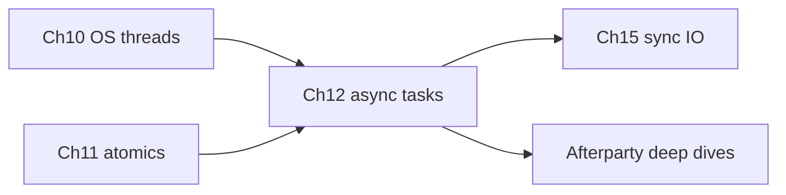

# Chapter 12: Async Rust and Tokio

## Hook

If you know Java `CompletableFuture` or Python `asyncio`, Rust async will feel familiar in shape but different in mechanics. The headline difference: **`async fn` returns a Future** — a lazy state machine that an **executor polls**; until you `.await` (or spawn), that work does not run. **Tokio** is the runtime most Rust services use for networking and concurrent I/O.

## Scope — a brief tour, not 100% of async Rust

Async Rust is a **large** ecosystem. This chapter is a **practical intro** — enough to read Tokio services and avoid executor footguns. It is **not** a runtime internals course or web-framework guide.

The table below splits what you get here from what to pick up later. Treat this chapter as a **map + first steps**, not the whole async territory.

| This chapter covers | Deferred to See also / Afterparty |
|---------------------|-----------------------------------|
| `async` / `.await`, Future mental model | Pin/Unpin formalism, `async` trait impls in depth ([Ch6](06_structs_traits_generics.md)) |
| Tokio: `#[tokio::main]`, `spawn`, `join!`, `select!`, `timeout` | `async-std`, embedded runtimes, runtime tuning |
| Blocking footgun + `spawn_blocking` | `block_in_place`, worker thread counts |
| Async I/O overview (`TcpListener`, `fs`) | Production TCP/Modbus stacks — [Chapter 15](15_io_processes_bits.md) |
| Shutdown via `Arc<AtomicBool>` ([Ch11 L6](11_atomics_and_lockfree.md)) | `axum`, `tonic`, stream combinators |

Use **Afterparty** prompts and **Go deeper** for echo servers, cancellation details, and async traits.

This chapter builds on [Chapter 10](10_multithreading.md) (threads) and [Chapter 11](11_atomics_and_lockfree.md) (atomics), and points forward to sync I/O in [Chapter 15](15_io_processes_bits.md):



## What async is

**Async** is cooperative concurrency: one OS thread can host many **tasks**, each pausing at `.await` so the executor can run others. Unlike [Chapter 10](10_multithreading.md) threads (OS-preempted), async tasks **yield voluntarily** — which makes blocking calls inside them dangerous.

| Idea | Plain language |
|------|----------------|
| **`async fn`** | Returns a **Future** — a state machine describing work; **does not run** until polled |
| **`.await`** | Pause **this** task until the step is ready; the **executor** runs other tasks |
| **Executor (Tokio)** | Thread pool + scheduler that **polls** futures to completion |
| vs **OS thread** ([Chapter 10](10_multithreading.md)) | Threads are preempted by the OS; async **cooperates** — a blocking call in one task can stall many |
| **Shared state** | Same concurrency rules: `Arc`, atomics ([Chapter 11](11_atomics_and_lockfree.md)), **`tokio::sync::Mutex`** — not `std::sync::Mutex` held across `.await` |

When a task hits `.await`, control returns to the executor until the waited-on step is ready:

```
caller .await ──► executor runs other tasks ──► future ready ──► caller resumes
```

### Level 0 — Mental model (sync stand-in, not async)

Before adding Tokio, anchor the **names** (`fetch`, `parse`, `log`) with ordinary sequential Rust. Real async needs a **runtime**; this Playground snippet is **not async** — it runs one step after another on one thread:

```rust
// Playground — conceptual; NOT async (no executor)
fn main() {
    let tasks = vec!["fetch", "parse", "log"];
    for t in tasks {
        println!("step: {}", t);
    }
}
```

**What happened:** prints **`step: fetch`**, **`parse`**, **`log`** in order — one thread, no concurrency. An `async fn` would **not** interleave until `.await` yields to Tokio.

All Tokio examples below are **Cargo projects**. Add this dependency once:

```toml
[dependencies]
tokio = { version = "1", features = ["full"] }
```

## Examples: elementary → hard

The levels below build from “start a runtime” to a small async supervisor. Work through in order; after each snippet, read **what happened** before moving on.

### Level 1 — Elementary: minimal Tokio spawn

Start here: boot Tokio with `#[tokio::main]`, spawn a child task, and **await** its join handle so `main` does not exit early.

```rust
// Cargo project
use tokio::time::{sleep, Duration};

#[tokio::main]
async fn main() {
    let handle = tokio::spawn(async {
        sleep(Duration::from_millis(50)).await;
        42
    });
    println!("result = {:?}", handle.await);
}
```

**What happened:**

- **`#[tokio::main]`** starts the Tokio runtime and runs `async fn main`.
- Child task sleeps 50 ms, returns **`42`**; **`handle.await`** waits for **`Ok(42)`**.
- Without **`.await`** on the handle, `main` could exit before the task finishes — dropped join handle **aborts** the task.

### Level 2 — Elementary: sequential vs concurrent `.await`

Writing two `.await`s in one function does **not** run them in parallel. Compare sequential awaits with **`tokio::join!`** to see real async concurrency:

```rust
// Cargo project
use tokio::time::{sleep, Duration, Instant};

async fn sequential() {
    sleep(Duration::from_millis(100)).await;
    sleep(Duration::from_millis(100)).await;
}

#[tokio::main]
async fn main() {
    let start = Instant::now();
    sequential().await;
    println!("sequential ~{} ms", start.elapsed().as_millis());

    let start = Instant::now();
    tokio::join!(
        sleep(Duration::from_millis(100)),
        sleep(Duration::from_millis(100)),
    );
    println!("join! ~{} ms", start.elapsed().as_millis());
}
```

**What happened:**

- **`sequential`** ≈ **200 ms** — second sleep starts after the first completes.
- **`tokio::join!`** ≈ **100 ms** — both sleeps run **concurrently** on the executor.
- For background work that outlives the caller, use **`tokio::spawn`** (Level 1).

### Level 3 — Medium: `join!` and `timeout`

Automation often waits on **multiple** device polls at once, and must **give up** when hardware is slow. `join!` waits for all branches; `timeout` caps how long one future may run:

```rust
// Cargo project
use tokio::time::{sleep, timeout, Duration};

async fn fast_poll() -> u16 {
    sleep(Duration::from_millis(10)).await;
    502
}

async fn slow_poll() -> u16 {
    sleep(Duration::from_millis(500)).await;
    8080
}

#[tokio::main]
async fn main() {
    let (a, b) = tokio::join!(fast_poll(), fast_poll());
    println!("join ports {} {}", a, b);

    match timeout(Duration::from_millis(50), slow_poll()).await {
        Ok(port) => println!("slow ok {}", port),
        Err(_) => eprintln!("slow poll timed out"),
    }
}
```

**What happened:**

- **`join!`** runs both **`fast_poll`** tasks concurrently → prints **`502 502`** quickly.
- **`timeout(50ms, slow_poll())`** returns **`Err(_)`** — slow poll needs 500 ms → automation **deadline** pattern for Modbus/serial timeouts.

### Level 4 — Medium: `select!` — first branch wins

When you want the **fastest** response and can abandon slower paths, `select!` races branches and **cancels** the losers:

```rust
// Cargo project
use tokio::time::{sleep, Duration};

async fn fast_cache_hit() -> &'static str {
    sleep(Duration::from_millis(5)).await;
    "cached"
}

async fn slow_device_read() -> &'static str {
    sleep(Duration::from_millis(200)).await;
    "device"
}

#[tokio::main]
async fn main() {
    let source = tokio::select! {
        v = fast_cache_hit() => v,
        v = slow_device_read() => v,
    };
    println!("source = {}", source);
}
```

**What happened:**

- Prints **`source = cached`** — fast branch completes first; **slow branch is cancelled** (dropped future).
- **Caveat:** cancelled work may stop mid-flight — ensure partial I/O is safe; see Afterparty for cancellation hygiene.

### Level 5 — Hard: blocking footgun + `spawn_blocking`

#### The problem in plain language

Tokio runs **many async tasks** on a **small** set of OS threads (often one per CPU core). Each thread is a **worker**. When a task hits `.await`, it **steps aside** so the worker can run other tasks. That is the whole trick: one thread, many tasks, no one waits unless they have to.

**Blocking** code does the opposite: it **never steps aside**. It sits on the worker until it finishes.

| What you call | What actually happens |
|---------------|------------------------|
| `thread::sleep(100ms)` inside `async fn` | Worker thread is **stuck** for 100 ms. Every other task assigned to that worker **waits**. |
| `tokio::time::sleep(100ms).await` | Task says “wake me in 100 ms” and **releases** the worker. Other tasks run during those 100 ms. |
| `std::fs::read` / heavy CPU on hot path | Same as `thread::sleep` — blocks the worker. |
| `tokio::task::spawn_blocking(...)` | Moves the blocking work to a **separate** thread pool built for blocking calls. Async workers stay free. |

**Restaurant analogy:** one waiter (worker) serves many tables (tasks). `.await` = “I’ll check back when the kitchen is ready” — waiter serves other tables. `thread::sleep` = waiter stands frozen at one table for 100 ms while other tables go ignored.

**Why it matters:** under load, a few `thread::sleep` or `std::fs::read` calls in async handlers can make **every** connection feel slow — not just the one that blocked.

#### What the code does (step by step)

1. **`bad_blocking`** — uses `std::thread::sleep`. Looks innocent; **does not yield**.
2. **`good_async_sleep`** — uses `tokio::time::sleep(...).await`. **Yields** correctly.
3. **`main`** runs two experiments with `tokio::join!`:
   - Pair `bad_blocking` with a 10 ms async sleep → the 10 ms task **cannot start** until the 100 ms block ends.
   - Pair `good_async_sleep` with the same 10 ms task → both run **together** (~100 ms total, not 110 ms).
4. **`spawn_blocking`** — when you **must** use blocking APIs (legacy sync library, `thread::sleep`, heavy file read), run that closure on Tokio’s blocking pool and `.await` the result back on the async side.

```rust
// Cargo project
use std::thread;
use std::time::Duration as StdDuration;
use tokio::time::{sleep, Duration, Instant};

async fn bad_blocking() {
    thread::sleep(StdDuration::from_millis(100)); // stalls executor worker
}

async fn good_async_sleep() {
    sleep(Duration::from_millis(100)).await; // yields — other tasks run
}

#[tokio::main]
async fn main() {
    let start = Instant::now();
    tokio::join!(bad_blocking(), sleep(Duration::from_millis(10)));
    println!("bad path elapsed ~{} ms (10 ms task delayed)", start.elapsed().as_millis());

    let start = Instant::now();
    tokio::join!(good_async_sleep(), sleep(Duration::from_millis(10)));
    println!("good path elapsed ~{} ms", start.elapsed().as_millis());

    let n = tokio::task::spawn_blocking(|| {
        thread::sleep(StdDuration::from_millis(50));
        99
    })
    .await
    .unwrap();
    println!("spawn_blocking -> {}", n);
}
```

Quick reference for what belongs inside an async task:

| Call | In async task? | Effect |
|------|----------------|--------|
| `std::thread::sleep` | **Bad** | blocks executor worker — other tasks wait |
| `tokio::time::sleep().await` | **Good** | yields until deadline |
| `std::fs::read` on hot path | **Risky** | blocks — prefer `tokio::fs` or **`spawn_blocking`** |
| `tokio::task::spawn_blocking` | **Good** | runs closure on blocking thread pool |

**What happened:**

- **`bad_blocking` + 10 ms task** — prints elapsed ≈ **100+ ms**. The 10 ms sleep **started late** because `thread::sleep` hogged the worker. Two “concurrent” tasks ran **one after another**.
- **`good_async_sleep` + 10 ms task** — prints elapsed ≈ **100 ms**. Both tasks **shared** the worker during waits; wall time is ~max(100, 10), not 100 + 10.
- **`spawn_blocking`** — prints **`spawn_blocking -> 99`**. The 50 ms `thread::sleep` ran on a **blocking** thread; async workers were not stuck.

**Rule of thumb:** in [Chapter 10](10_multithreading.md), `thread::sleep` on its own OS thread only blocks **that** thread. Inside Tokio async code, it blocks a **shared** worker — so it hurts **all** tasks on that worker.

### Level 6 — Hard: async gateway supervisor

#### What this example is

This is the **same gateway pattern** as [Chapter 11 Level 6](11_atomics_and_lockfree.md), but the worker is a **Tokio task** instead of an OS thread:

| Piece | Role |
|-------|------|
| **`Gateway`** | Shared state: poll counter + shutdown flag |
| **`Arc<Gateway>`** | Lets `main` and the worker **both** hold the same struct safely |
| **`run_worker`** | Loop: sleep 5 ms → increment `polls` → repeat until shutdown |
| **`tokio::spawn`** | Starts the worker **in the background** without blocking `main` |
| **`shutdown` flag** | `main` sets `true`; worker sees it and exits the loop cleanly |

Think of **`main` as supervisor**, **`run_worker` as the poll loop** on a device gateway. Supervisor runs for 25 ms, prints how many polls happened, then tells the worker to stop and waits for a clean exit.

#### How the flow works

```
main                          worker (spawned task)
 │                                  │
 ├─ create Arc<Gateway>             │
 ├─ spawn run_worker ──────────────►│ loop: if !shutdown
 │                                  │   sleep 5ms (.await — yields!)
 │                                  │   polls += 1
 ├─ sleep 25ms (.await)             │   (keeps looping…)
 ├─ print polls count               │
 ├─ shutdown = true ───────────────►│ sees shutdown, exits loop
 ├─ await join handle ◄─────────────┤ returns Ok(())
 └─ print "supervisor done"          │
```

**Why atomics again?** Same as Chapter 11: `polls` is a **metric** (`Relaxed` is fine). `shutdown` is a **signal** — `Release` when main writes, `Acquire` when the worker reads — so the worker **definitely** sees the stop request.

**Why `sleep(...).await` in the worker?** Each 5 ms pause **yields** to Tokio. A `thread::sleep` here would block a worker on every iteration (Level 5 footgun).

```rust
// Cargo project
use std::sync::atomic::{AtomicBool, AtomicUsize, Ordering};
use std::sync::Arc;
use tokio::time::{sleep, Duration};

struct Gateway {
    polls: AtomicUsize,
    shutdown: AtomicBool,
}

async fn run_worker(gw: Arc<Gateway>) -> Result<(), &'static str> {
    while !gw.shutdown.load(Ordering::Acquire) {
        sleep(Duration::from_millis(5)).await;
        gw.polls.fetch_add(1, Ordering::Relaxed);
    }
    Ok(())
}

#[tokio::main]
async fn main() -> Result<(), &'static str> {
    let gw = Arc::new(Gateway {
        polls: AtomicUsize::new(0),
        shutdown: AtomicBool::new(false),
    });

    let worker_gw = Arc::clone(&gw);
    let handle = tokio::spawn(async move { run_worker(worker_gw).await });

    sleep(Duration::from_millis(25)).await;
    println!("metrics polls={}", gw.polls.load(Ordering::Relaxed));

    gw.shutdown.store(true, Ordering::Release);
    handle.await.map_err(|_| "worker join failed")??;
    println!("supervisor done");
    Ok(())
}
```

**What happened (line by line):**

1. **`Arc::new(Gateway { ... })`** — one gateway in memory; `Arc` allows shared ownership.
2. **`Arc::clone(&gw)` + `tokio::spawn`** — worker gets its own `Arc` handle; runs **concurrently** with `main`.
3. **`sleep(25ms).await`** — supervisor waits without blocking a worker thread; worker keeps polling during this time.
4. **`polls.load(Relaxed)`** — read-only metric; prints something like **`metrics polls=4`** (exact count varies slightly — ~25 ms ÷ 5 ms per loop).
5. **`shutdown.store(true, Release)`** — “stop after this loop iteration.”
6. **`handle.await`** — wait until the worker task **finishes** (not just until shutdown is set).
   - Outer `Result`: task panicked → `Err` (mapped to `"worker join failed"`).
   - Inner `Result`: `run_worker` returned `Ok(())` or an error from the async fn.
   - The **`??`** applies `?` twice — once for join failure, once for `run_worker`’s `Result`.
7. **`supervisor done`** — worker exited; no dangling background task.

**Compared to Chapter 11:** replace `thread::spawn` + `thread::sleep` with `tokio::spawn` + `tokio::time::sleep().await`. The **atomics and shutdown pattern stay the same** — only the concurrency runtime changes.

**`main() -> Result`** ([Chapter 7](07_errors_and_testing.md)): errors bubble to one place instead of scattering `unwrap()` in the supervisor. In a real binary you might add `eprintln!` and a non-zero exit code at the top level.

## Techniques at a glance

Use this table as a cheat sheet while reading Tokio code elsewhere. Each row maps to a level above.

| Technique | One-line use | Level |
|-----------|--------------|-------|
| `async fn` / `.await` | lazy futures; yield points | 0–2 |
| `#[tokio::main]` | start Tokio runtime | 1 |
| `tokio::spawn` | concurrent background task | 1, 6 |
| `tokio::join!` | wait for **all** branches | 2–3 |
| `tokio::select!` | **first** ready branch | 4 |
| `tokio::time::timeout` | deadline / device timeout | 3 |
| `spawn_blocking` | sync I/O or `thread::sleep` off executor | 5 |
| `tokio::sync::mpsc` | async message passing | Afterparty |
| `Arc<AtomicBool>` | shutdown flag across tasks | 6, Ch11 |

**Mutex choice:** use **`tokio::sync::Mutex`** if the lock may be held across `.await`. Holding **`std::sync::MutexGuard`** across `.await` makes the future **`!Send`** — the compiler rejects it (see edge cases below).

## Async I/O (brief)

Networking and file I/O are where async pays off: many connections wait on kernel I/O while a small thread pool keeps working. Tokio mirrors std I/O with **async** APIs — `.await` instead of blocking the thread:

| Sync ([Ch15](15_io_processes_bits.md)) | Async (Tokio) |
|----------------------------------------|---------------|
| `std::fs::read` | `tokio::fs::read` |
| `TcpListener::accept` | `tokio::net::TcpListener::accept().await` |

The sketch below accepts one connection, reads bytes, and echoes them back — a minimal pattern before a multi-connection server:

```rust
// Cargo project — outline
use tokio::io::{AsyncReadExt, AsyncWriteExt};
use tokio::net::TcpListener;

#[tokio::main]
async fn main() -> Result<(), Box<dyn std::error::Error>> {
    let listener = TcpListener::bind("127.0.0.1:0").await?;
    let (mut socket, _) = listener.accept().await?;
    let mut buf = [0u8; 64];
    let n = socket.read(&mut buf).await?;
    socket.write_all(&buf[..n]).await?;
    Ok(())
}
```

Many connections → **one process**, **many tasks** — each `accept` can `tokio::spawn` a handler. Full protocols and error handling: [Chapter 15](15_io_processes_bits.md) + Afterparty.

## Async vs OS threads

You already have OS threads from [Chapter 10](10_multithreading.md). Async is not a replacement — it is a different tool for **many concurrent waits** on a small thread pool:

| | OS threads ([Ch10](10_multithreading.md)) | Async tasks (Tokio) |
|---|-------------------------------------------|---------------------|
| Best for | CPU-bound parallel work | Many **I/O waits** (TCP, timers) |
| Stack / memory | higher per thread | many tasks on thread pool |
| Blocking call | blocks one thread only | **blocks executor worker** — hurts all tasks on that worker |
| Shared shutdown | `Arc<AtomicBool>` ([Ch11](11_atomics_and_lockfree.md)) | same atomics behind `tokio::spawn` |

When choosing for an automation gateway:

```
many idle TCP/serial waits?     → async
CPU-bound parallel compute?     → threads (or rayon — Ch10 Afterparty)
one simple PLC poll loop?       → single thread may suffice
1000 connections, one process?  → async
```

## Edge cases and compiler traps

These mistakes show up constantly in real Tokio code. The table lists the symptom and the fix; the snippets below are **wrong on purpose** so you recognize them in the wild.

| Trap | Symptom | Idiom |
|------|---------|-------|
| Forgot `.await` | logic never runs; unused future warning | always `.await` or `spawn` |
| No runtime | `async fn main` won't run futures | `#[tokio::main]` |
| `std::thread::sleep` in async | latency spikes for all tasks | `tokio::time::sleep` / `spawn_blocking` |
| `MutexGuard` across `.await` | `Future not Send` compile error | `tokio::sync::Mutex`; drop guard before await |
| Blocking `std::fs` on hot path | executor starvation | `tokio::fs` / `spawn_blocking` |
| `select!` cancels losing branch | partial work / leaked state | scope cancellation; abort handles — Afterparty |

**Wrong — `std::sync::MutexGuard` across `.await`:**

```rust
// Cargo project — does not compile
use std::sync::Mutex;
use tokio::time::{sleep, Duration};

async fn bad(m: Mutex<i32>) {
    let _guard = m.lock().unwrap();
    sleep(Duration::from_millis(10)).await;
    // ERROR: future cannot be sent between threads safely (MutexGuard not Send)
}

// fn main() { tokio::runtime::Runtime::new().unwrap().block_on(bad(Mutex::new(0))); }
```

**Wrong — drop future without `.await`:**

```rust
// Cargo project
async fn important() {
    println!("never runs if not awaited");
}

#[tokio::main]
async fn main() {
    important(); // warning: unused Future — does NOT run
    // important().await; // correct
}
```

## Idiom spotlight

One paragraph to carry into production code:

> **Async for many I/O waits; threads for CPU-heavy or a single simple poll loop.** Never block the executor — **`tokio::time::sleep`**, not **`thread::sleep`**. Share shutdown with **`Arc<AtomicBool>`** ([Chapter 11](11_atomics_and_lockfree.md)). Bubble errors with **`?`** and **`main() -> Result`** at the boundary ([Chapter 7](07_errors_and_testing.md)).

## Go deeper

When this chapter’s ladder is not enough, these links cover fundamentals, channels, I/O, and the official Tokio walkthrough:

- [async fn and .await fundamentals](https://hightechmind.io/rust/) — 321
- [Async channels mpsc](https://hightechmind.io/rust/) — 328
- [Async I/O](https://hightechmind.io/rust/) — 342, 921
- [Tokio tutorial](https://tokio.rs/tokio/tutorial)

## See also

Related chapters — read these when you need threads, atomics, errors, sync I/O, or async traits in depth:

- [Chapter 10: Multithreading](10_multithreading.md) — when threads beat async
- [Chapter 11: Atomics](11_atomics_and_lockfree.md) — `Arc<AtomicBool>` shutdown in async
- [Chapter 7: Errors](07_errors_and_testing.md) — `Result` boundary in `main`
- [Chapter 15: I/O](15_io_processes_bits.md) — sync I/O and processes
- [Chapter 6: Traits](06_structs_traits_generics.md) — async traits (advanced)

### Afterparty: AI Lego blocks

Copy a prompt into your AI tutor. This chapter is a **brief tour** — use these for topics deliberately shortened above.

#### Concepts and mental model

Prompts to solidify how futures, polling, and scope fit together:

1. **Future diagram** — “Draw state machine for `async fn` with two `.await` points.”
2. **Poll vs await** — “Who polls the Future — caller, executor, or Tokio runtime?”
3. **Executor vs thread** — “One paragraph: cooperative async vs preemptive OS threads.”
4. **Scope honesty** — “List 5 async topics Ch12 skips and where to learn each.”
5. **Forgotten await** — “Show unused Future bug; fix with `.await` or `spawn`.”

#### Tokio basics

Runtime setup, spawn lifecycle, and error boundaries:

6. **Tokio scaffold** — “Minimal `#[tokio::main]` + `spawn` + join handle — explain each line.”
7. **Spawn vs await** — “What if `main` drops join handle without `.await`?”
8. **Join handle `??`** — “Explain the `??` on `handle.await` in Level 6 — outer join `Result` vs inner `run_worker` `Result`.”

#### Level 5–6 drills

Reinforce blocking vs yielding and the async gateway supervisor:

9. **Bad join timing** — “Walk through Level 5 bad path: why does a 10 ms task wait ~100 ms when paired with `thread::sleep`?”
10. **Ch11 port** — “Compare Level 6 to [Ch11 L6](11_atomics_and_lockfree.md) — what changes with `tokio::spawn`, what stays the same?”
11. **Supervisor timeline** — “Trace Level 6 step by step: when does the worker stop, and why must it use `tokio::time::sleep` not `thread::sleep`?”

#### Concurrency primitives

When to wait for all vs first, deadlines, and cancellation:

12. **join vs select** — “Two slow tasks: when `join!` vs `select!`? One automation example each.”
13. **select! scenario** — “Cancel slow request when fast path returns — full `select!` sketch.”
14. **Timeout drill** — “Wrap Modbus read `async fn` with 100 ms timeout; handle `Elapsed`.”
15. **Cancellation hygiene** — “What runs when `select!` drops the losing branch? Modbus read vs cache hit example.”

#### Blocking and I/O

Keeping the executor healthy while doing real device and file work:

16. **Blocking fix** — “Audit async snippet with `thread::sleep`, `std::fs::read`; fix each.”
17. **spawn_blocking** — “When `tokio::fs` vs `spawn_blocking` for config file read?”
18. **Tcp echo** — “Expand Async I/O outline to multi-connection echo with `spawn` per accept.”

#### Async vs threads

Architecture choices for gateways and connection counts:

19. **async vs thread** — “1000 Modbus polls — argue async vs thread pool for latency.”
20. **200 TCP connections** — “One process — async vs thread-per-connection memory story.”
21. **When thread enough** — “Single serial port poll — justify thread loop over Tokio.”

#### Atomics and shared state (Ch11)

Bridging lock-free flags from Chapter 11 into async tasks:

22. **Async sleep in worker** — “Why must Level 6’s poll loop use `tokio::time::sleep().await` on every iteration, not `thread::sleep`?”
23. **tokio Mutex** — “Rewrite bad `std::sync::MutexGuard` across await with `tokio::sync::Mutex`.”

#### Production capstone

Review exercises that mix blocking audit with the full level ladder:

24. **Blocking audit** — “Mark 6 snippets: async-safe vs executor poison vs needs `spawn_blocking`.”
25. **Level ladder recap** — “Explain Levels 0–6 in one paragraph each — Tokio mechanics only.”
