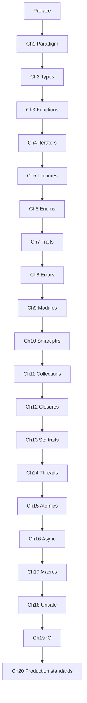

# Table of Contents

**Rust Core** (draft edition) — Part of [Vibe Learning](../README.md). Paradigm → crates → concurrency → power tools → std I/O.

---

## Preface

| Doc | File |
|-----|------|
| [Preface](chapters/preface.md) | `chapters/preface.md` |

## Part I — Language foundation

| Ch | Title | File |
|----|-------|------|
| 1 | [Paradigm shift](chapters/01_paradigm_shift.md) | `chapters/01_paradigm_shift.md` |
| 2 | [Types and expressions](chapters/02_types.md) | `chapters/02_types.md` |
| 3 | [Functions and methods](chapters/03_functions.md) | `chapters/03_functions.md` |
| 4 | [Iterators](chapters/04_iterators.md) | `chapters/04_iterators.md` |
| 5 | [Lifetimes](chapters/05_lifetimes.md) | `chapters/05_lifetimes.md` |
| 6 | [Enums and pattern matching](chapters/06_types_enums_pattern_matching.md) | `chapters/06_types_enums_pattern_matching.md` |
| 7 | [Structs, traits, and generics](chapters/07_structs_traits_generics.md) | `chapters/07_structs_traits_generics.md` |
| 8 | [Errors and testing](chapters/08_errors_and_testing.md) | `chapters/08_errors_and_testing.md` |

## Part II — Crates, memory, and data

| Ch | Title | File |
|----|-------|------|
| 9 | [Modules, paths, and crates](chapters/09_modules_paths_crates.md) | `chapters/09_modules_paths_crates.md` |
| 10 | [Smart pointers and interior mutability](chapters/10_smart_pointers_interior_mutability.md) | `chapters/10_smart_pointers_interior_mutability.md` |
| 11 | [Collections](chapters/11_collections.md) | `chapters/11_collections.md` |
| 12 | [Closures and the Fn traits](chapters/12_closures.md) | `chapters/12_closures.md` |
| 13 | [Standard traits and conversions](chapters/13_standard_traits.md) | `chapters/13_standard_traits.md` |

## Part III — Concurrency

| Ch | Title | File |
|----|-------|------|
| 14 | [Multithreading](chapters/14_multithreading.md) | `chapters/14_multithreading.md` |
| 15 | [Atomics and lock-free basics](chapters/15_atomics_and_lockfree.md) | `chapters/15_atomics_and_lockfree.md` |
| 16 | [Async Rust and Tokio](chapters/16_async_tokio.md) | `chapters/16_async_tokio.md` |

## Part IV — Metaprogramming and unsafe

| Ch | Title | File |
|----|-------|------|
| 17 | [Metaprogramming](chapters/17_metaprogramming.md) | `chapters/17_metaprogramming.md` |
| 18 | [Unsafe and when to stop](chapters/18_unsafe_and_internals.md) | `chapters/18_unsafe_and_internals.md` |

## Part V — Standard library I/O

| Ch | Title | File |
|----|-------|------|
| 19 | [I/O, processes, and bits](chapters/19_io_processes_bits.md) | `chapters/19_io_processes_bits.md` |

## Part VI — Production standards

| Ch | Title | File |
|----|-------|------|
| 20 | [Production Rust standards](chapters/20_production_standards.md) | `chapters/20_production_standards.md` |

## Appendices

| Doc | Purpose |
|-----|---------|
| [AI Prompt Index](appendix/AI_PROMPT_INDEX.md) | Afterparty prompts (**P001–P401**) |
| [Playground Guide](appendix/PLAYGROUND_GUIDE.md) | Run snippets online vs locally |
| [Java / Python / Rust map](appendix/JAVA_PYTHON_RUST_MAP.md) | Optional mental-model cheat sheet |

---

## Suggested pace

| Part | Chapters | Rough time |
|------|----------|------------|
| I | 1–8 (+ preface) | 14–20 h |
| II | 9–13 | 10–14 h |
| III | 14–16 | 8–12 h |
| IV | 17–18 | 6–10 h |
| V | 19 | 3–5 h |
| VI | 20 | 2–3 h (review checklist; revisit after shipping code) |

Adjust for depth; concurrency chapters reward repetition.

---

## Reading order (mermaid)

