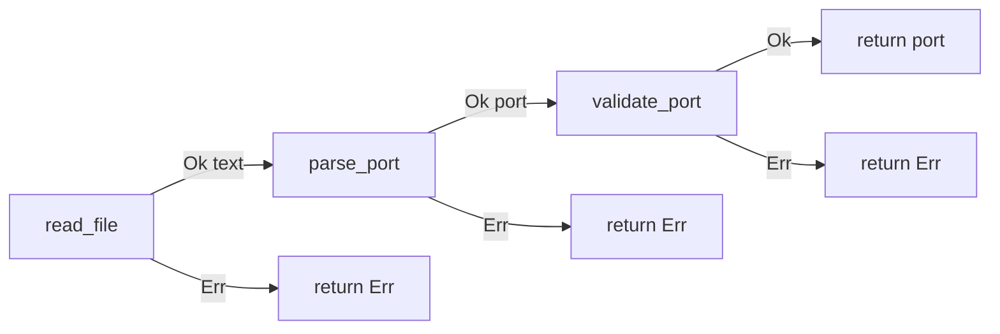

# Chapter 8: Errors and Testing

## Hook

Many languages use exceptions for control flow (**Java** checked/unchecked throws, **Python** `raise`, …). Rust splits **recoverable** (`Result`) from **unrecoverable** (`panic!`). Long-running code should treat errors as data, not surprises.

**Why `panic!` / `unwrap()` in production is a bad idea**

A **panic** stops the thread — often the whole process. Use it for bugs, not for expected failures like bad config or offline devices.

| Expected failure (data) | Panic (crash) |
|-------------------------|---------------|
| Log, alert operator, retry next poll | Whole gateway or PLC bridge **down** until someone restarts it |
| Return `Err` to caller — choose fallback port or safe state | No chance to enter **safe mode** or drain the queue |
| Error is **typed and testable** in the signature | Failure is a **surprise** at a random `unwrap()` line |

At service boundaries, use **`?` on `Result`** — not `unwrap` on ports, config, or field I/O. Full panic mechanics below; see also [Chapter 6 — avoid `unwrap` in automation](06_types_enums_pattern_matching.md#option-edge-cases-and-compiler-traps).

## Panic, unwind, and why it is not `Result`

When Rust **panics** (`panic!`, failed `assert!`, `unwrap` on `Err`/`None`), the runtime treats the situation as **non-recoverable for this thread**. What happens next depends on the panic strategy:

| Strategy | Behaviour | Typical target |
|----------|-----------|----------------|
| **Unwind** (default on many hosts) | Walk the stack **backwards**; run **`Drop` on each frame**; then thread dies or error propagates | desktop, server |
| **Abort** (`panic = "abort"`) | **Immediate process exit** — no `Drop`, no cleanup | embedded, some release builds |

**Unwind** is Rust’s structured stack retreat — closer to C++ exceptions or Java unwinding than to returning `Err`. It is **not** “return an error value”.

```
normal Result path:  open()?  →  Err(io::Error)  →  caller matches, logs, retries
panic path:          unwrap() →  panic!          →  unwind stack  →  thread/process gone
```

### Problems unwind creates in production

1. **No typed error in the signature** — callers cannot `match` on what went wrong; the thread just stops.
2. **`Drop` runs under panic** — destructors flush buffers, close handles, release locks. If **`Drop` also panics**, Rust **aborts the whole process** (double panic).

3. **Partial cleanup story** — during unwind, some resources are dropped and some code never runs. Invariants may be left mid-update unless you designed for it.
4. **Unattended automation** — a Modbus poll loop that panics on one bad frame **stops all future polls**. A `Result` lets you log, skip, and continue.
5. **`catch_unwind` is a niche tool** — it can catch unwinding panics in isolated blocks (e.g. foreign callbacks). It **must not** replace `Result` for business logic. It misses **`abort` panics**, has **`UnwindSafe` bounds**, and adds complexity.

```rust
// Playground — illustration only; not idiomatic error handling
use std::panic;

fn main() {
    let outcome = panic::catch_unwind(|| {
        panic!("simulated bug");
    });
    println!("caught panic: {:?}", outcome.is_err());
}
```

For PLC gateways and serial bridges: **`Result` at boundaries**, **`panic` for programmer mistakes**.

## Error propagation

[Chapter 6](06_types_enums_pattern_matching.md) introduced `Result<T, E>`. This section is the **railway**: each step returns `Result`; **`?`** exits early on `Err` and passes the success value forward. No unwind, no panic.



**Layered gateway load** (playground — uses manual `AppError` defined below):

```rust
// Playground
#[derive(Debug)]
enum AppError {
    Parse(String),
    OutOfRange(u16),
}

fn read_file(path: &str) -> Result<String, AppError> {
    // stand-in for std::fs::read_to_string in demos
    if path.is_empty() {
        Err(AppError::Parse("empty path".into()))
    } else {
        Ok("8080".into())
    }
}

fn parse_port(text: &str) -> Result<u16, AppError> {
    text.trim()
        .parse()
        .map_err(|_| AppError::Parse(text.into()))
}

fn validate_port(port: u16) -> Result<u16, AppError> {
    if port < 1024 {
        Err(AppError::OutOfRange(port))
    } else {
        Ok(port)
    }
}

fn load_gateway_config(path: &str) -> Result<u16, AppError> {
    let text = read_file(path)?;
    let port = parse_port(&text)?;
    validate_port(port)?;
    Ok(port)
}

fn run() -> Result<u16, AppError> {
    load_gateway_config("config.toml")
}

fn main() {
    match run() {
        Ok(port) => println!("gateway on {}", port),
        Err(e) => eprintln!("startup failed: {:?}", e),
    }
    println!("{:?}", parse_port("8080").and_then(validate_port));
}
```

Each `?` is an **early return** of `Err` — same idea as Java `throw`, but the error type is visible in every signature. The `match` in `main` is the **boundary**; `run` and helpers bubble errors with `?`.

### Three propagation tools

| Tool | Use when | Effect on `Err` |
|------|----------|-----------------|
| **`?`** | Inside `fn -> Result<_, E>` | return `Err` immediately (via `From` if types differ) |
| **`.map` / `.map_err`** | Transform value or error in place | stay in `Result`; no early exit from current function |
| **`.and_then`** | Next fallible step on success | chain; equivalent to `?` inside a closure |

```rust
// Playground
fn parse_doubled(s: &str) -> Result<u32, String> {
    s.trim()
        .parse::<u32>()
        .map_err(|e| e.to_string())
        .map(|p| p * 2)
}

fn main() {
    println!("{:?}", parse_doubled("21"));
}
```

`.and_then(validate_port)` in the gateway example chains two fallible steps without a separate function body.

### Internal vs boundary

| Layer | Who | Pattern |
|-------|-----|---------|
| **Internal** | library helpers, poll loop body | `?` bubble `Err` up — no printing here |
| **Boundary** | `main`, HTTP handler, PLC supervisor | one `match` or `if let Err(e) = run()` — log, exit code, retry |

In the gateway example above: `read_file` / `parse_port` / `validate_port` / `load_gateway_config` are **internal**; `main`'s `match run()` is the **boundary**.

### Example: read first line from a file (**Cargo only**)

```rust
// Cargo project — needs std::fs
use std::fs::File;
use std::io::{self, Read};

fn read_first_line(path: &str) -> Result<String, io::Error> {
    let mut f = File::open(path)?;
    let mut buf = String::new();
    f.read_to_string(&mut buf)?;
    Ok(buf.lines().next().unwrap_or("").to_string())
}

fn main() {
    match read_first_line("Cargo.toml") {
        Ok(s) => println!("{}", s),
        Err(e) => println!("error: {}", e),
    }
}
```

| Line | What it does |
|------|----------------|
| `-> Result<String, io::Error>` | Success = first line; failure = std I/O error (no panic). |
| `File::open(path)?` | Propagate open failure — **return path**, not unwind. |
| `f.read_to_string(&mut buf)?` | Same for read errors. |
| `unwrap_or("")` | Empty file → `""`; **not** a panic path. |
| `match` in `main` | **Boundary** — process keeps running after logging. |

**Playground equivalent:**

```rust
// Playground
fn parse_config(s: &str) -> Result<u32, String> {
    s.trim().parse::<u32>().map_err(|e| e.to_string())
}

fn main() {
    println!("{:?}", parse_config("8080"));
    println!("{:?}", parse_config("oops"));
}
```

**What `?` desugars to:**

```rust
let mut f = match File::open(path) {
    Ok(v) => v,
    Err(e) => return Err(e),
};
```

### Propagation edge cases

**Wrong — `?` in a function that does not return `Result` (or `Option`):**

```rust
// Playground — does not compile
fn broken(s: &str) -> u32 {
    s.parse::<u32>()? // ERROR: the `?` operator can only be used in a function that returns `Result` or `Option`
}
```

**`?` on `Option` inside `fn -> Option`** ([Chapter 6](06_types_enums_pattern_matching.md)):

```rust
// Playground
fn first_word(s: &str) -> Option<&str> {
    let word = s.split_whitespace().next()?; // None → return None
    Some(word)
}
```

**Wrong — error type mismatch with `?`:**

```rust
// Playground — does not compile
enum AppError { Io(std::io::Error) }

fn read(path: &str) -> Result<String, AppError> {
    let mut buf = String::new();
    std::fs::File::open(path)?.read_to_string(&mut buf)?; // ERROR: `?` can't convert `io::Error` to `AppError`
    Ok(buf)
}
```

Fix: `map_err`, `From` impl, or **`thiserror`** `#[from]` — see below.

**Wrong — `unwrap` where `?` belongs:**

```rust
// Playground — runs, panics on bad input (unwind path)
fn load_port(s: &str) -> u16 {
    s.parse().unwrap()
}
```

**Idiomatic poll loop** — log and continue:

```rust
// Playground
fn poll_port(s: &str) {
    match s.parse::<u16>() {
        Ok(p) => println!("poll ok {}", p),
        Err(e) => eprintln!("bad config, skip tick: {}", e),
    }
}

fn main() {
    poll_port("502");
    poll_port("oops");
}
```

| Helper | On failure | Production use |
|--------|------------|----------------|
| `?` | return `Err` | library / internal propagation |
| `match` / `if let` | branch | boundaries, loops, recovery |
| `unwrap()` / `expect("…")` | **panic**, unwind | tests, prototypes, truly impossible |
| `unwrap_or` / `unwrap_or_else` | default value | safe fallback (not for I/O errors) |

## Std library errors — fine for learning, weak for production

Std error types are **correct** and **zero-dependency** — perfect for tutorials and tiny scripts. Real automation pain comes from **ergonomics and maintainability**, not from `io::Error` being wrong.

| Std type | Problem in production automation |
|----------|----------------------------------|
| `io::Error` | Opaque; `ErrorKind` matching is brittle; hard to attach *which config file* or *which device* |
| `String` / `&str` | Not **`match`**able by variant; context lost when re-wrapped; easy to typo the same message twice |
| `ParseIntError` etc. | Tiny; no path/key context; every callsite needs manual `map_err` |
| Manual `impl Error` | Boilerplate: `Display`, `source()`, `From` for each wrapped type — easy to forget |

| Stage | Error type | Tooling |
|-------|------------|---------|
| Playground / first week | `String`, `&str`, manual enum | none |
| **Library crate / gateway core** | **`enum` + `thiserror`** | derive `Error`, `#[from]`, `#[error("…")]` |
| **Binary / CLI / service `main`** | **`anyhow::Result`** | `.context("while loading config")` chains |

**Honest take:** add **`thiserror`** to any library or gateway core you will maintain. Use std errors while learning; switch before you ship.

## Custom errors

### Manual `enum` — learn the model

Real automation crates combine variants (parse, I/O, device timeout) instead of a bare `String`:

```rust
// Playground
#[derive(Debug)]
enum AppError {
    Parse(String),
    OutOfRange(u32),
}

fn set_port(s: &str) -> Result<u16, AppError> {
    let p: u16 = s.parse().map_err(|_| AppError::Parse(s.into()))?;
    if p < 1024 {
        Err(AppError::OutOfRange(p as u32))
    } else {
        Ok(p)
    }
}

fn main() {
    println!("{:?}", set_port("8080"));
    println!("{:?}", set_port("80"));
    println!("{:?}", set_port("oops"));
}
```

| Line | What it does |
|------|----------------|
| `enum AppError` | Closed set of failure modes — **`match`** at boundaries. |
| `map_err(...)` | Turn parse failure into **your** variant with context. |
| `?` | Propagate `Err(AppError::Parse(...))` early. |
| `if p < 1024 { Err(...) }` | Business rule as **data** — no panic. |

**What manual production code still needs** (what `thiserror` generates for you):

```rust
// Playground — conceptual boilerplate; use thiserror instead
use std::fmt;

impl fmt::Display for AppError {
    fn fmt(&self, f: &mut fmt::Formatter<'_>) -> fmt::Result {
        match self {
            AppError::Parse(s) => write!(f, "invalid port '{s}'"),
            AppError::OutOfRange(p) => write!(f, "port {p} below privileged range"),
        }
    }
}

impl std::error::Error for AppError {}
```

Add `source()` when wrapping `io::Error` — another ~10 lines per variant. **`thiserror` generates this for you.**

**Chaining with `?` across error types** — implement `From`:

```rust
// Playground
use std::num::ParseIntError;

#[derive(Debug)]
enum AppError {
    Parse(String),
    OutOfRange(u32),
}

impl From<ParseIntError> for AppError {
    fn from(_: ParseIntError) -> Self {
        AppError::Parse("invalid integer".into())
    }
}

fn set_port_from(s: &str) -> Result<u16, AppError> {
    let p: u16 = s.parse()?; // `?` converts via From
    if p < 1024 {
        Err(AppError::OutOfRange(p as u32))
    } else {
        Ok(p)
    }
}

fn main() {
    println!("{:?}", set_port_from("8080"));
}
```

### `thiserror` in production — count it in

For libraries and gateway cores, **`thiserror`** replaces manual `Display` + `Error` + `From` with one derive.

**Cargo.toml:**

```toml
[dependencies]
thiserror = "2"
```

**Cargo project example:**

```rust
// Cargo project
use thiserror::Error;

#[derive(Debug, Error)]
pub enum AppError {
    #[error("failed to read config at {path}")]
    ConfigRead {
        path: String,
        #[source]
        source: std::io::Error,
    },

    #[error("invalid port '{raw}'")]
    ParsePort {
        raw: String,
        #[source]
        source: std::num::ParseIntError,
    },

    #[error("port {0} below privileged range")]
    OutOfRange(u16),

    #[error("device timeout after {ms} ms")]
    Timeout { ms: u64 },

    #[error("serial error")]
    Serial(#[from] SerialError),
}

#[derive(Debug, Error)]
pub enum SerialError {
    #[error("framing error")]
    Framing,
    #[error("crc mismatch")]
    Crc,
}
```

| Attribute / line | What it does |
|------------------|--------------|
| `#[derive(Error)]` | Generates `Display` + `std::error::Error` + `source()` chain |
| `#[error("…")]` | Operator-facing message template — no manual `fmt` |
| `#[source]` | Underlying error preserved for logs / `error.chain()` |
| `Serial(#[from] SerialError)` | Auto `From<SerialError>` — use `?` on serial helpers |

**Same railway, less noise:**

```rust
// Cargo project — with thiserror AppError above
use std::fs;

pub fn load_gateway_config(path: &str) -> Result<u16, AppError> {
    let text = fs::read_to_string(path).map_err(|source| AppError::ConfigRead {
        path: path.into(),
        source,
    })?;
    let port = text
        .trim()
        .parse()
        .map_err(|source| AppError::ParsePort {
            raw: text.clone(),
            source,
        })?;
    if port < 1024 {
        return Err(AppError::OutOfRange(port));
    }
    Ok(port)
}
```

With `#[from]` on `io::Error` variant you could shorten further. Trade explicit context vs brevity.

### `anyhow` for binaries (sidebar)

Use **`anyhow`** in **`main`** and binary crates — not in library public APIs:

```rust
// Cargo project — binary crate
// anyhow = "1"

use anyhow::Context;

fn load_gateway_config(_path: &str) -> Result<u16, std::io::Error> {
    // stand-in for lib helper from the thiserror example above
    Ok(8080)
}

fn run() -> anyhow::Result<()> {
    let port = load_gateway_config("config.toml")
        .context("loading gateway config")?;
    println!("port {}", port);
    Ok(())
}

fn main() -> anyhow::Result<()> {
    run()
}
```

**Pairing:** use a `thiserror` enum in **`lib`** for typed errors for callers. Use `anyhow` in **`bin`** for context chains at the top. See [errors and enums](#errors-and-enums) for matching variants at the boundary.

### Crate-local `Result` alias

Large modules repeat the same error type on every signature. A **type alias** fixes the error side once:

```rust
// Playground
#[derive(Debug)]
pub enum GatewayError {
    Timeout,
    Parse(String),
}

pub type Result<T> = std::result::Result<T, GatewayError>;

pub fn poll() -> Result<f64> {
    Ok(42.0)
}

fn main() {
    println!("{:?}", poll());
}
```

Use **`pub type Result<T> = std::result::Result<T, MyError>`** in library roots — not in public APIs that re-export `std::result::Result` ambiguously. Document the alias in crate docs.

### Transparent `#[from]` variants

Wrap subsystem errors without a custom message — **`#[error(transparent)]`** forwards `Display` and `source()`:

```rust
// Cargo project — conceptual with thiserror
use thiserror::Error;

#[derive(Debug, Error)]
pub enum AppError {
    #[error("config read failed")]
    Config { source: std::io::Error },

    #[error(transparent)]
    Serial(#[from] SerialError),
}

#[derive(Debug, Error)]
pub enum SerialError {
    #[error("framing error")]
    Framing,
}

fn read_frame() -> Result<(), AppError> {
    Err(SerialError::Framing.into()) // `?` works on SerialError helpers
}

fn main() {
    let _ = read_frame();
}
```

### Error aggregation for batch work

Stream and batch pipelines often collect **per-item failures** and report them together instead of failing silently on the first error. A small trait keeps the merge logic reusable:

```rust
// Playground
#[derive(Debug)]
struct ItemError {
    line: usize,
    msg: String,
}

#[derive(Debug)]
enum BatchError {
    Multiple { errors: Vec<ItemError> },
}

trait FromMultipleErrors<E> {
    fn from_multiple(errors: Vec<E>) -> Self;
}

impl FromMultipleErrors<ItemError> for BatchError {
    fn from_multiple(errors: Vec<ItemError>) -> Self {
        Self::Multiple { errors }
    }
}

fn flush_errors(errors: Vec<ItemError>) -> Result<(), BatchError> {
    if errors.is_empty() {
        Ok(())
    } else {
        Err(BatchError::from_multiple(errors))
    }
}

fn main() {
    let errs = vec![
        ItemError { line: 3, msg: "bad port".into() },
        ItemError { line: 9, msg: "missing tag".into() },
    ];
    println!("{:?}", flush_errors(errs));
}
```

Format the **`Display`** message for `Multiple` variants to list each sub-error — operators need the full list, not “something failed”.

## Extension traits on `Option`

Hand-written parsers repeat `ok_or_else` for required fields. An **extension trait** on `Option<T>` centralizes the error shape ([Chapter 7](07_structs_traits_generics.md#extension-traits-in-your-crate)):

```rust
// Playground
#[derive(Debug)]
enum ParseError {
    MissingField { name: String },
}

trait RequiredField<T> {
    fn required(self, name: &str) -> Result<T, ParseError>;
}

impl<T> RequiredField<T> for Option<T> {
    fn required(self, name: &str) -> Result<T, ParseError> {
        self.ok_or_else(|| ParseError::MissingField {
            name: name.to_string(),
        })
    }
}

fn parse_unit_id(fields: &std::collections::HashMap<&str, &str>) -> Result<u8, ParseError> {
    let raw = fields.get("unit_id").copied().required("unit_id")?;
    raw.parse::<u8>()
        .map_err(|_| ParseError::MissingField { name: "unit_id".into() })
}

fn main() {
    let mut m = std::collections::HashMap::new();
    m.insert("unit_id", "7");
    println!("{:?}", parse_unit_id(&m));
}
```

Name constructors on the error enum (`ParseError::missing_field(...)`) keep call sites even shorter ([Chapter 3](03_functions.md#error-constructor-factories)).

### Custom error edge cases

**Wrong — `Result<T, String>` in a library public API:**

```rust
// Playground — works, but avoid in libraries
pub fn connect(host: &str) -> Result<(), String> {
    Err("timeout".into()) // callers cannot match variants — only string compare
}
```

**Wrong — panic inside error path:**

```rust
// Playground — anti-pattern
fn bad(s: &str) -> Result<u16, AppError> {
    s.parse().unwrap_or_else(|_| panic!("bad port {}", s))
}
```

**Match at boundary for operator-facing messages:**

```rust
// Playground
#[derive(Debug)]
enum AppError {
    Parse(String),
    OutOfRange(u32),
}

fn set_port(s: &str) -> Result<u16, AppError> {
    let p: u16 = s
        .parse()
        .map_err(|_| AppError::Parse(s.into()))?;
    if p < 1024 {
        Err(AppError::OutOfRange(p as u32))
    } else {
        Ok(p)
    }
}

fn main() {
    match set_port("80") {
        Ok(p) => println!("listening on {}", p),
        Err(AppError::OutOfRange(p)) => eprintln!("port {} needs root", p),
        Err(AppError::Parse(s)) => eprintln!("not a port: {:?}", s),
    }
}
```

## Errors and enums

Your error type **is an enum** — same machinery as `Option`, `Result`, and domain enums in [Chapter 6](06_types_enums_pattern_matching.md). Use **`match`** in helpers and **`#[derive(Error)]`** instead of hand-written trait impls ([Chapter 7](07_structs_traits_generics.md)).

### Variant shapes for errors

| Shape | Example | Use |
|-------|---------|-----|
| Unit | `Timeout` | simple tag |
| Tuple | `OutOfRange(u16)` | single payload |
| Struct | `ConfigRead { path, source }` | context + `#[source]` |
| `#[from]` wrapper | `Serial(#[from] SerialError)` | transparent propagation |

```rust
// Playground — error enum mirrors Ch6 enum shapes
#[derive(Debug)]
enum GatewayError {
    Timeout,                              // unit
    OutOfRange(u16),                      // tuple
    ConfigRead { path: String },          // struct
}
```

### Error enum vs domain enum — keep them separate

| Type | Models | `match` purpose |
|------|--------|-----------------|
| **`Command`** (domain) | what the PLC sends | dispatch behaviour |
| **`AppError`** (error) | what went wrong | recovery / logging / exit codes |

Do not merge domain commands and error variants into one enum — they have different lifecycles.

### Recovery by variant

Automation often **branches on error kind** without panicking:

```rust
// Playground — conceptual poll with typed recovery
#[derive(Debug)]
enum AppError {
    Timeout { ms: u64 },
    ParsePort { raw: String },
    DeviceOffline,
}

fn poll_device() -> Result<f64, AppError> {
    Err(AppError::Timeout { ms: 500 })
}

fn handle_poll() {
    match poll_device() {
        Ok(v) => println!("stored {}", v),
        Err(AppError::Timeout { .. }) => eprintln!("retry next tick"),
        Err(AppError::ParsePort { raw }) => eprintln!("fix config: {}", raw),
        Err(AppError::DeviceOffline) => eprintln!("alert operator"),
    }
}

fn main() {
    handle_poll();
}
```

| Variant | Typical recovery |
|---------|------------------|
| `Timeout` | retry, backoff |
| `ParsePort` | alert config team, skip startup |
| `DeviceOffline` | alarm, safe state |

### Nested error enums

Subsystem errors as their own enum, embedded in the top-level error:

```rust
// Playground
#[derive(Debug)]
enum SerialError {
    Framing,
    Crc,
}

#[derive(Debug)]
enum AppError {
    Serial(SerialError),
    Timeout { ms: u64 },
}

fn read_frame() -> Result<(), AppError> {
    Err(AppError::Serial(SerialError::Crc))
}

fn main() {
    if let Err(AppError::Serial(SerialError::Crc)) = read_frame() {
        eprintln!("crc fail — request retransmit");
    }
}
```

Same pattern as **struct-in-enum** in [Chapter 7](07_structs_traits_generics.md#enums-structs-and-traits-together).

### Errors-and-enums edge cases

**Exhaustiveness — add a variant, update every `match`:**

```rust
// Playground — does not compile until you handle DeviceOffline everywhere
#[derive(Debug)]
enum AppError {
    Timeout { ms: u64 },
    DeviceOffline, // new
}

fn describe(e: &AppError) -> &'static str {
    match e {
        AppError::Timeout { .. } => "timeout",
        // AppError::DeviceOffline => "offline",  // ERROR: non-exhaustive
    }
}
```

**`source()` vs matching the enum** — match **`AppError` variants** for recovery policy. Inspect **`source()`** only when you need the underlying `io::Error` kind for logging.

**`#[non_exhaustive]`** on public library error enums allows adding variants without breaking downstream `match` exhaustiveness. Downstream must keep a wildcard arm.

**Wrong — `Result` inside an enum variant** (usually an anti-pattern):

```rust
// Playground — awkward; prefer Result at the fn level
enum Messy {
    Pending(Result<u16, AppError>),
}
```

Model outcomes with **`fn -> Result<T, E>`** or a dedicated domain enum. Do not nest `Result` inside unrelated enums.

| Trap | Idiom |
|------|-------|
| String errors in lib API | `enum` + `thiserror` |
| Mixed domain + error variants | two enums |
| New error variant | compiler lists every `match` — treat as feature |
| Need underlying I/O kind | `#[source]` + logging, not string formatting |

## `panic!` vs recover — decision table

| Mechanism | Control flow | Cleanup | Caller can react? |
|-----------|--------------|---------|-------------------|
| `Result` / `Option` | normal return | you decide in `match` | **yes** |
| `panic!` / `unwrap` | unwind or abort | `Drop` on unwind; abort skips it | **no** (except `catch_unwind` niche) |

| Use | When |
|-----|------|
| `Result` | Missing file, bad input, timeout, CRC fail, device NAK |
| `Option` | Optional value, “not found” without error detail |
| `panic!` / `assert!` | Logic bug, violated invariant, test failure |
| `expect("…")` | Same as unwrap but message names the invariant (still panics) |

**Libraries should not panic on bad user input.** Binaries may use `main() -> Result<(), E>` and print once at the top:

```rust
// Playground — CLI pattern (conceptual)
fn run() -> Result<(), AppError> {
    let port = set_port("8080")?;
    println!("port {}", port);
    Ok(())
}

fn main() {
    if let Err(e) = run() {
        eprintln!("fatal: {:?}", e);
        std::process::exit(1);
    }
}
```

Exit code + message at **one** boundary — not scattered `unwrap`s.

### Panic and unwind edge cases

**Panic in `Drop` → abort:**

```rust
// Playground — do not do this; conceptual
struct Bad;
impl Drop for Bad {
    fn drop(&mut self) {
        panic!("drop panicked");
    }
}
// let _b = Bad;
// drop triggers panic; if already panicking → abort
```

**Thread panic without handler** — spawned thread panics can **`join` as `Err`**. If ignored, the runtime may **abort the whole program** on drop of an unjoined panicking thread.

**`assert!` in production paths** — failed assert is a panic (unwind/abort), not a graceful `Result`. Prefer explicit checks returning `Err`.

| Trap | Symptom | Idiom |
|------|---------|-------|
| `unwrap` on config/I/O | process exit on bad deploy | `?` + log at boundary |
| `?` wrong return type | compile error | change signature or `map_err` / `From` |
| panic in `Drop` | double panic → **abort** | never panic in `Drop` |
| `catch_unwind` as policy | fragile, not for business errors | use `Result` |
| empty file vs missing file | `unwrap_or("")` vs `open()?` | separate “not found” from “empty” if it matters |

## Testing

Tests use **`assert!` / `assert_eq!`** — a failed test **panics** (that is intentional; CI catches it). Production error paths should not rely on panics for expected cases.

**Cargo only:**

```rust
// src/lib.rs or same file with #[cfg(test)]
pub fn add(a: i32, b: i32) -> i32 {
    a + b
}

pub fn parse_port(s: &str) -> Result<u16, String> {
    let p: u16 = s.parse().map_err(|e| e.to_string())?;
    Ok(p)
}

#[cfg(test)]
mod tests {
    use super::*;

    #[test]
    fn adds() {
        assert_eq!(add(2, 2), 4);
    }

    #[test]
    fn parse_valid_port() {
        assert_eq!(parse_port("502").unwrap(), 502);
    }

    #[test]
    fn parse_rejects_non_numeric() {
        assert!(parse_port("oops").is_err()); // prefer is_err over unwrap in negative tests
    }
}
```

**What each piece does:**

| Piece | Role |
|-------|------|
| `pub fn` | tests in `mod tests` import via `use super::*` |
| `#[cfg(test)]` | module compiled **only** when running `cargo test` — zero cost in release binary |
| `assert_eq!` | equality check; fails test with diff on mismatch |
| `parse_port("502").unwrap()` | **OK in tests** — failure means test broken, not field conditions |
| `is_err()` | checks error path **without** panicking the test runner |

```bash
cargo test
```

Also: **doc tests** in `///` examples and **integration tests** in `tests/*.rs` (external crate view of your API).

### Testing edge cases

**Table-driven tests** — one function, many inputs:

```rust
// Playground
fn parse_port(s: &str) -> Result<u16, String> {
    let p: u16 = s.parse().map_err(|e: std::num::ParseIntError| e.to_string())?;
    Ok(p)
}

#[cfg(test)]
mod table {
    use super::parse_port;

    #[test]
    fn ports() {
        for (input, ok) in [("502", true), ("0", true), ("oops", false)] {
            assert_eq!(parse_port(input).is_ok(), ok, "input={input}");
        }
    }
}

fn main() {}
```

**Testing `Result` errors** — use `match`, `.unwrap_err()`, or crates like `assert_matches` instead of panicking on unexpected `Ok`.

### Trait-based mocks — test orchestration, not I/O

Production code depends on **traits** ([Chapter 7](07_structs_traits_generics.md#trait-decomposition--small-interfaces)). Tests supply a **mock struct** that implements the same trait and records calls:

```rust
// Playground
use std::cell::RefCell;

trait DeviceWriter {
    fn write_reading(&self, tag: &str, value: f64);
}

struct LiveWriter;

impl DeviceWriter for LiveWriter {
    fn write_reading(&self, tag: &str, value: f64) {
        println!("live {}={}", tag, value);
    }
}

struct MockWriter {
    pub calls: RefCell<Vec<(String, f64)>>,
}

impl DeviceWriter for MockWriter {
    fn write_reading(&self, tag: &str, value: f64) {
        self.calls.borrow_mut().push((tag.to_string(), value));
    }
}

fn ingest<W: DeviceWriter>(w: &W, tag: &str, value: f64) {
    w.write_reading(tag, value);
}

#[cfg(test)]
mod mock_tests {
    use super::*;

    #[test]
    fn records_one_write() {
        let mock = MockWriter {
            calls: RefCell::new(Vec::new()),
        };
        ingest(&mock, "temp", 22.5);
        assert_eq!(mock.calls.borrow().len(), 1);
    }
}

fn main() {}
```

Use **`RefCell`** or **`Mutex`** in mocks when the trait takes `&self` but tests need interior mutability. Async traits use the same pattern with **`#[async_trait]`** and **`#[tokio::test]`** ([Chapter 16](16_async_tokio.md#async-trait-boundaries-for-testing)).

### Golden-file and shared parser tests

Parsers fit a **shared test helper**: read input fixture, run the parser, compare to expected output. One helper covers every source format:

```rust
// Playground — pattern sketch
fn parse_line(line: &str) -> Result<(String, f64), String> {
    let (tag, val) = line
        .split_once('=')
        .ok_or_else(|| "missing '='".to_string())?;
    Ok((tag.into(), val.parse().map_err(|e| e.to_string())?))
}

#[cfg(test)]
mod golden {
    use super::parse_line;

    #[test]
    fn sample_lines() {
        let inputs = ["temp=22.5", "press=101.3"];
        let expected: Vec<_> = inputs
            .iter()
            .map(|s| parse_line(s).unwrap())
            .collect();
        assert_eq!(expected.len(), 2);
    }
}
```

For large nested structs, **`pretty_assertions::assert_eq`** (dev-dependency) prints colored diffs on failure — worth it in data-heavy tests.

### Comparable test DTOs — normalize before equality

Golden comparisons often fail on **benign differences** (whitespace, sort order). Build a **test-only comparable type** that normalizes:

```rust
// Playground
#[derive(Debug, PartialEq)]
struct Reading {
    tag: String,
    value: f64,
}

#[derive(Debug, PartialEq)]
struct ComparableReading {
    tag: String,
    value_milli: i64,
}

impl ComparableReading {
    fn from_reading(r: Reading) -> Self {
        Self {
            tag: r.tag.trim().to_lowercase(),
            value_milli: (r.value * 1000.0).round() as i64,
        }
    }
}

#[cfg(test)]
mod compare {
    use super::*;

    #[test]
    fn normalizes_whitespace_and_float() {
        let a = ComparableReading::from_reading(Reading {
            tag: " Temp ".into(),
            value: 22.499,
        });
        let b = ComparableReading::from_reading(Reading {
            tag: "temp".into(),
            value: 22.5,
        });
        assert_eq!(a, b);
    }
}

fn main() {}
```

### Test-only derives with `cfg_attr`

Production types may skip **`Deserialize`** or **`PartialEq`** to keep dependencies lean. Tests opt in with **`cfg_attr`**:

```rust
// Playground
#[derive(Debug, Clone, PartialEq)]
#[cfg_attr(test, derive(serde::Deserialize))]
struct RegionOffsets {
    start: u64,
    end: u64,
}

fn main() {
    let _ = RegionOffsets { start: 0, end: 10 };
}
```

Requires `serde` as a **dev-dependency** when you deserialize fixtures in tests only.

### Async tests

Stream and parser tests that use `.await` need a runtime:

```rust
// Cargo project — needs tokio with "macros" + "rt"
#[tokio::test]
async fn delayed_ok() {
    tokio::time::sleep(std::time::Duration::from_millis(1)).await;
    assert_eq!(2 + 2, 4);
}
```

See [Chapter 16](16_async_tokio.md) for `#[tokio::test]` and spawn patterns.

## Idiom spotlight

> **Libraries:** `enum` + **`thiserror`** — typed variants, `#[from]` for `?`, `#[error("…")]` for messages. **Never `Result<T, String>` in a public API.**
>
> **Binaries:** **`anyhow`** at `main` for context chains; map `thiserror` errors at the boundary.
>
> **Propagation:** `?` inside helpers; **one** `match` or `main() -> Result` at the edge. Expected failures are **data**; panics **unwind** (or **abort**) — wrong tool for retry loops on a factory floor.
>
> **Batch pipelines:** aggregate per-item errors; **extension traits on `Option`** for required fields. **Mock traits** in tests — same interface as production I/O.

## Go deeper

- [Result railway](https://hightechmind.io/rust/)
- [Unit test patterns](https://hightechmind.io/rust/) — 744+
- [thiserror docs](https://docs.rs/thiserror/latest/thiserror/)

## See also

- [Chapter 6: Result enum](06_types_enums_pattern_matching.md)
- [Chapter 7: Enums + traits](07_structs_traits_generics.md#enums-structs-and-traits-together) — same enum machinery for errors
- [Chapter 19: I/O errors](19_io_processes_bits.md)

### Afterparty

#### Error propagation

1. **? chain** — “Refactor nested `match` on `Result`s to `?` railway; explain each desugared `return Err`.”
2. **map / and_then** — “Same parser with `.map_err` + `.map` vs `.and_then(validate)`; when to use each.”
3. **Wrong return type** — “Show `?` compile error in `fn -> u32`; fix signature and boundary `match`.”
4. **Poll loop** — “Rewrite `unwrap` Modbus config parse to log-and-continue; process must survive bad line.”
5. **Internal vs boundary** — “Mark 8 functions in a gateway crate: bubble with `?` or handle in `main`?”

#### Panic, unwind, and production

6. **Unwind vs Result** — “Diagram stack for `open()?` vs `unwrap()` on missing file; who runs `Drop`?”
7. **panic audit** — “Mark 10 `unwrap`/`expect` sites: keep (test/invariant) vs `Result` (I/O/config).”
8. **Drop double panic** — “Explain why panicking in `Drop` aborts; sketch safe cleanup pattern.”
9. **catch_unwind scope** — “When is `catch_unwind` appropriate vs abuse? One automation anti-example.”
10. **abort strategy** — “Embedded firmware: `panic = abort` — what cleanup is skipped vs unwind?”

#### Std errors, thiserror, anyhow

11. **Std limits** — “List 4 pain points of `io::Error` + `String` errors in a Modbus gateway; no FUD.”
12. **Manual vs thiserror** — “Same `AppError` twice: hand-written `Display`/`Error`/`From` vs `#[derive(Error)]`; count lines saved.”
13. **thiserror design** — “Design `GatewayError` with ConfigRead, ParsePort, Timeout, Serial sub-enum; full derive attrs.”
14. **anyhow vs thiserror** — “Pick for automation binary vs library crate; show `main -> anyhow::Result` + `.context()`.”
15. **Why not String** — “Explain why `pub fn connect() -> Result<(), String>` is weak; propose enum API.”

#### Errors and enums

16. **Error enum design** — “Design `AppError` for config + serial + timeout; variant shapes + recovery `match`.”
17. **Recovery match** — “Poll loop: Timeout → retry, ParsePort → alert, DeviceOffline → safe state — sketch `match`.”
18. **Nested SerialError** — “Add `AppError::Serial(SerialError)`; show propagation with `#[from]`.”
19. **Exhaustive trap** — “Add `DeviceOffline` variant; quote non-exhaustive `match` errors until fixed.”

#### Custom errors and boundaries

20. **Boundary pattern** — “`run() -> Result` + `main` maps to exit code; no `unwrap` in between.”
21. **map_err drill** — “Convert `ParseIntError` → `AppError::Parse` with and without `From` / `#[from]`.”

#### Testing

22. **Table-driven ports** — “Tests for `parse_port`: valid, zero, non-numeric, too large for `u16`.”
23. **Integration test** — “Sketch `tests/config_load.rs` that expects `Err` on missing file without panicking.”
