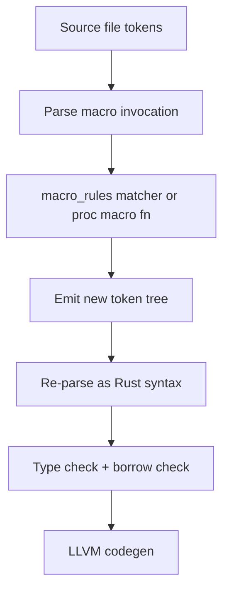

# Chapter 17: Metaprogramming

## Hook

Metaprogramming varies by ecosystem — **Java** annotations and reflection, **Python** metaclasses, Rust macros at compile time. Rust metaprogramming is mostly **compile-time**. Macros expand source **before** type checking — zero runtime cost for `macro_rules!` and derive.

| Approach | When it runs | Typical cost |
|----------|--------------|--------------|
| Java reflection | Runtime | Slow; errors at runtime |
| Lombok / annotation processors | Compile time | IDE-dependent |
| Python metaclass | Import / class creation | Runtime setup |
| Rust `macro_rules!` / derive | Compile time | No runtime overhead |
| Rust `const fn` / `const` | Compile time | Baked into binary |

## Scope — a brief tour

Intro to `macro_rules!`, derive, and `const` — not proc-macro authoring with `syn`/`quote`.

| This chapter covers | Deferred to See also / Afterparty |
|---------------------|-----------------------------------|
| `macro_rules!`, fragments, repetition, hygiene | Writing proc macros with `syn`/`quote` |
| **`#[derive]` syntax**, annotations vs decorators, std + ecosystem + **custom** derives, **Clone/Copy**, **serde JSON round-trip** | Proc-macro authoring with `syn`/`quote`, `build.rs` codegen |
| `const` / `const fn` / `env!` / `include_str!` | `generic_const_exprs`, advanced const traits |
| Forbidden matcher clauses, **edge cases**, **why macros are hard to trace** | Miri, macro fuzzing, proc-macro testing |

## Compile-time pipeline

**Mental model:** the compiler sees your source as **tokens**, expands every macro invocation, then type-checks the **expanded** program.

```
source tokens → macro expansion → type check + borrow check → LLVM
```

Macros match **syntax trees** (tokens), not types. A macro can compile while the **expanded** code fails. Errors often say `in expansion of macro ...`.

## Under the hood — what the compiler actually does

Brief peek inside — enough to make restrictions and debugging feel logical:



**Declarative (`macro_rules!`):**

- The **matcher** compares token trees against patterns with fragment specifiers (`expr`, `ty`, …).
- The **transcriber** pastes captured fragments into a template — substitution, not evaluation of Rust code.
- No access to types, trait bounds, or name resolution at match time — only token shape.

**Procedural (`#[derive]`, `sql!`, …):**

- The compiler calls a proc-macro function with a **`TokenStream`** (tokens + span metadata).
- The macro runs as **normal Rust at compile time** (often using `syn` + `quote`) and returns another `TokenStream`.
- A **`proc-macro = true` crate** may export **only** proc macros. Helpers live in a sibling crate — a hard platform rule.

**Hygiene (why names “disappear”):**

- Macro-generated identifiers get a fresh **syntax context**. They do not collide with caller locals, but also **won't resolve** to caller bindings unless passed as `$x:expr`.
- `$crate` exists so exported macros refer to **their** crate's paths, not the caller's.

## `macro_rules!`

```rust
// Playground
macro_rules! say_hello {
    () => { println!("Hello!"); };
    ($name:expr) => { println!("Hello, {}!", $name); };
}

fn main() {
    say_hello!();
    say_hello!("Automation");
}
```

**What happened:** the macro matches **token patterns** — empty `()` or one expression — and expands to `println!` calls before type checking.

### Fragment specifiers

| Specifier | Matches | Use when |
|-----------|---------|----------|
| `expr` | expression | values, calls, literals |
| `ident` | identifier | names, field keys |
| `ty` | type | generic params, type slots |
| `pat` | pattern | `match` arms in macro-generated code |
| `stmt` | statement (no trailing `;`) | one-line statements |
| `block` | `{ ... }` block | multi-statement bodies |
| `item` | fn, struct, mod, … | generating whole items |
| `literal` | `42`, `"hi"`, `true` | numeric / string constants |
| `tt` | token tree | escape hatch — match almost anything |

### Repetition

```rust
// Playground
macro_rules! vec_str {
    ($($x:expr),*) => {{
        let mut v = Vec::new();
        $( v.push(String::from($x)); )*
        v
    }};
}

fn main() {
    let v = vec_str!["a", "b"];
    println!("{:?}", v);
}
```

**What happened:**

- `$()*` repeats zero or more times — `vec_str![]` would work with `*`, not with `+`.
- `$( ... )*` in the output expands once per matched input.
- Trailing comma: `$(x),*` allows `"a", "b",` — common Rust style.

| Modifier | Meaning |
|----------|---------|
| `*` | zero or more |
| `+` | one or more |
| `?` | zero or one |

### Level 2 — automation: register map

Map symbolic register names to addresses — typical Modbus-style tables:

```rust
// Playground
macro_rules! register_map {
    ($($name:ident = $addr:literal),* $(,)?) => {{
        fn addr_of(name: &str) -> Option<u16> {
            match name {
                $( stringify!($name) => Some($addr), )*
                _ => None,
            }
        }
        addr_of
    }};
}

fn main() {
    let lookup = register_map!(temp = 0x01, pressure = 0x02);
    println!("{:?}", lookup("temp"));
}
```

**What happened:** `ident` captures names; `literal` captures `u16` values; repetition builds a `match` over `stringify!` keys — all at compile time, zero runtime parsing of a table file.

**Reading the matcher** — `($($name:ident = $addr:literal),* $(,)?) => {{`:

```
register_map!(temp = 0x01, pressure = 0x02)
                 └─ one repetition ─┘  └─ second ─┘
```

| Piece | Meaning |
|-------|---------|
| `$( ... ),*` | Repeat **zero or more** times, separated by **commas** |
| `$name:ident` | Capture an **identifier** token (`temp`, `pressure`) |
| `=` | Literal `=` in the input — not a capture |
| `$addr:literal` | Capture a **literal** (`0x01`, `0x02`, `502`, …) |
| `$(,)?` | Optional **trailing comma** after the last entry (`temp = 0x01,` is OK) |
| `=> {{` … `}}` | Expand to a **block** that defines `addr_of` and **returns** that function |

For `register_map!(temp = 0x01, pressure = 0x02)`, the macro expands roughly to:

```rust
{
    fn addr_of(name: &str) -> Option<u16> {
        match name {
            "temp" => Some(0x01),      // stringify!(temp) + $addr
            "pressure" => Some(0x02),
            _ => None,
        }
    }
    addr_of   // block’s value — caller gets the lookup fn
}
```

Each `$( stringify!($name) => Some($addr), )*` in the macro body runs **once per** `name = addr` pair in the invocation — that is how one macro call generates many `match` arms.

### Hygiene and `$crate`

Exported macros should use `$crate::` for paths inside **your** crate so re-exports and dependency trees resolve correctly. Macro-generated `let` names are **hygienic** — they won't accidentally shadow or capture caller locals.

Debug expanded code:

```bash
cargo install cargo-expand
cargo expand --bin my_app   # in a Cargo project
```

Conceptual `cargo expand` on `#[derive(Debug)]` for `Point` emits an `impl Debug for Point { fn fmt(...) { ... } }` — the derive proc macro wrote that impl; you never see it in source unless you expand.

## Syntax forbidden or restricted in macros — and why

The macro matcher is a **separate, weaker parser** that must stay **unambiguous today and in future Rust editions** ([follow-set rules](https://doc.rust-lang.org/reference/macros-by-example.html#follow-set-ambiguity-restrictions)).

**Important nuance:** follow-set rules limit what can follow `$e:expr` in a **matcher** — not what a macro can **emit**. You can still generate `for` loops in expanded code.

What is restricted: (1) keywords **after** `$e:expr` / `$s:stmt` in a matcher, and (2) expanding **multiple statements** where Rust expects a **single expression**.

### Follow-set: keywords after `expr` / `stmt`

For `$e:expr` and `$s:stmt`, the only tokens allowed **immediately after** the fragment in a matcher are `=>`, `,`, and `;`. Nothing else — not `=`, not `for`, not `let`, not `if`, not `>>`.

| Fragment | May only be followed by | Forbidden example | Why |
|----------|-------------------------|-------------------|-----|
| `expr`, `stmt` | `=>`, `,`, `;` | `$a:expr for $i:ident in $r:expr` | `for` could start a trailing expression — parser won't commit |
| `expr`, `stmt` | `=>`, `,`, `;` | `$a:expr let $x:ident = $v:expr` | same follow-set rule |
| `expr`, `stmt` | `=>`, `,`, `;` | `$a:expr >> $b:expr` | `>>` could be part of a future expression |
| `pat`, `pat_param` | `=>`, `,`, `=`, `\|`, `if`, **`in`**, … | `$p:pat + $q:pat` | `+` not in follow-set — but **`in` is allowed** |
| `ty`, `path` | `=>`, `,`, `=`, `\|`, `;`, `:`, `>`, `>>`, `[`, `{`, `as`, `where`, … | `$t:ty + $u:ty` | `+` might start a different grammar production |

**Wrong — `$e:expr` followed by `for` (matcher fails at macro definition):**

```rust
// Playground — does not compile
macro_rules! bad_foreach_matcher {
    ($e:expr for $i:ident in $r:expr) => { $e };
}
// error: `$e:expr` is followed by `for`, which is not allowed for `expr` fragments
// note: allowed there are: `=>`, `,` or `;`
```

**Wrong — `$e:expr` followed by `=`:**

```rust
// Playground — does not compile
macro_rules! set_reg {
    ($addr:expr = $val:expr) => { /* ... */ };
}
// error: `$addr:expr` is followed by `=`, which is not allowed for `expr` fragments
// FIX: set_reg!(0x01, 42) or set_reg! { 0x01 => 42 }
```

**Right — `$p:pat` followed by `in` (foreach-style matcher):**

The keyword **`in`** is in the follow-set for `pat` / `pat_param`, so this pattern is **legal**. Literal `for` comes *before* the pattern, not after an `expr`:

```rust
// Playground
macro_rules! foreach {
    ($p:pat in $r:expr => $body:expr) => {
        for $p in $r { $body }
    };
}

fn main() {
    foreach!(i in 0..3 => println!("tick {}", i));
}
```

**What happened:** the matcher uses `$p:pat in $r:expr` — allowed because `in` follows `pat`. The transcriber emits a normal `for` loop. This is how you write “mini foreach” macros without breaking follow-set rules.

### Expression position vs statement expansion (`let`, `for`, multiple lines)

A macro invoked where Rust expects an **expression** (`let x = mac!();`, `mac!() + 1`) must expand to **one** expression. A bare `{ let a = 1; for i in 0..n { ... } }` block is a **block expression** and can work.

A transcribe template with **multiple statements** separated at the top level often breaks.

**Wrong — `let` + `for` in expression position (single-brace body):**

```rust
// Playground — does not compile when used as expression
macro_rules! poll_twice {
    () => {
        let n = 2;
        for i in 0..n {
            println!("poll {}", i);
        }
    };
}

fn main() {
    let _x = poll_twice!();
    // error: expected expression, found `let` statement
    // note: macro expansion ignores keyword `for` and any tokens following
}
```

**Fix — double braces `{{ ... ; last_expr }}`:**

```rust
// Playground
macro_rules! poll_twice {
    () => {{
        let n = 2;
        for i in 0..n {
            println!("poll {}", i);
        }
        () // block's value — unit, or return a count/Result
    }};
}

fn main() {
    let _x = poll_twice!();
}
```

**What happened:** outer `{ ... }` is the macro's transcribe delimiter. Inner `{ ... ; () }` is a **block expression** — one value Rust can assign to `_x`. Without the inner block, `let` and `for` are loose statements, invalid in expression position.

| Situation | Works? | Pattern |
|-----------|--------|---------|
| `for` loop only, used as expression | often yes (loop is an expression) | `=> { for ... { } }` |
| `let` then `for`, used as expression | no (single braces) | `=> {{ let ...; for ...; value }}` |
| `for` after `$e:expr` in **matcher** | never | use `$p:pat in $r:expr` or change DSL punctuation |
| `for` in macro **output** at statement position | yes | `poll_twice!();` as its own statement |

Same logic applies to **`let`**, **`while`**, and **`match`** when they appear **after** an `expr` fragment in a matcher. It also applies to **`let`-heavy expansions** in expression context.

**Other important limits:**

| Rule | What breaks | Why |
|------|-------------|-----|
| Forwarded fragments are **opaque** | Inner macro can't match literals inside outer `$e:expr` | Fragment is an AST blob |
| No type introspection in `macro_rules!` | “Derive Clone only for Clone fields” | Macro sees tokens, not types — needs proc macro |
| Recursion depth cap (~128) | `recursion limit exceeded` | Protects compile time |
| `ident` excludes `$crate` | Reserved for path injection | Hygiene |

**Escape hatch:** `tt` (token tree) matches delimited chunks — **you** validate structure (often in a proc macro with `syn`).

## Standard library macros you already use

| Macro | Role |
|-------|------|
| `vec!`, `format!`, `println!` | collection / formatting |
| `matches!` | pattern guard sugar ([Chapter 6 — Advanced patterns](06_types_enums_pattern_matching.md#advanced-patterns)) |
| `env!`, `option_env!` | build-time strings ([Preface](preface.md)) |
| `include_str!`, `concat!`, `stringify!` | embed / stringify at compile time |
| `cfg!`, `assert!`, `debug_assert!` | conditional compile / tests |
| `todo!`, `unimplemented!` | stub markers |

```rust
// Playground
fn main() {
    let name = env!("CARGO_PKG_NAME"); // compile-time; needs Cargo project
    let msg = format!("running {}", name);
    assert!(matches!(msg.as_str(), s if s.starts_with("running")));
    println!("{}", msg);
}
```

## Derive attributes

`#[derive(...)]` is **core Rust syntax** — not optional decoration. You place it **above** a `struct` or `enum` to auto-implement one or more **traits** before type checking runs. You will see it from the first error enum ([Chapter 3](03_functions.md)) through config types ([Chapter 13](13_standard_traits.md)), `thiserror` ([Chapter 8](08_errors_and_testing.md)), and `serde` below.

```rust
// Playground
#[derive(Debug, Clone, PartialEq)]
struct Point {
    x: i32,
    y: i32,
}

fn main() {
    let a = Point { x: 1, y: 2 };
    let b = a.clone();
    println!("{:?} == {:?} ? {}", a, b, a == b);
}
```

Comma-separated trait names in one attribute: `#[derive(Debug, Clone)]`. Field-level helpers (e.g. `#[serde(rename = "...")]`) sit on individual fields and are interpreted by the same ecosystem crate — see [Serde JSON](#serde-json--serialize-and-deserialize) below.

### Not annotations or decorators

If you come from **Java**, **Python**, **C#**, or **TypeScript**, do **not** read `#[derive]` as an annotation or decorator. The mental model is different.

| Habit from other languages | What you might assume | What Rust `#[derive]` actually does |
|----------------------------|----------------------|-------------------------------------|
| Java `@Override`, `@SuppressWarnings` | Hints to compiler / IDE | **Generates Rust source** (`impl` blocks) at compile time |
| Java Spring `@Autowired`, JAX-RS annotations | Runtime wiring via reflection | **No runtime reflection** — expanded code is normal Rust |
| Python `@property`, `@staticmethod` | Wraps or replaces the function at **call time** | **Does not wrap** your type — emits trait impls once at **compile time** |
| Python `@dataclass` | Runtime class builder | Closest cousin — but Rust expand is **before** type check, zero runtime cost |
| C# / TypeScript **decorators** | Metadata or method interception at runtime | Rust derive is **not** interception — it is **codegen** |
| Lombok `@Data` (compile-time Java) | Closest analogy | Still different: Rust errors are in **your** crate's type check, not a separate processor pass |

**Rules of thumb for migrants:**

- **`#[derive(Name)]`** → “run the proc macro registered for `Name`” — usually emits `impl` for a trait also called `Name` (compile time).
- **`#[some_attr]`** on a **function** (e.g. `#[test]`, `#[tokio::main]`) → attribute proc macro — also compile time, but not `derive`; see [Proc macros — three kinds](#proc-macros-three-kinds).
- **No attribute runs when you call a function** unless you explicitly invoked a macro that generated that call.

### Mechanics

1. `#[derive(Name)]` looks up a **registered derive proc macro** for that identifier — built into the compiler (`Debug`, `Clone`, …) or shipped in a dependency (`Serialize`, `Error`, …).
2. The macro **expands** and typically emits `impl SomeTrait for YourType { ... }` (and sometimes extra items). **`Name` is usually the same as `SomeTrait`**, but the compiler invokes the **macro registration**, not “any `trait` you defined.”
3. The compiler type-checks the expanded code like hand-written Rust.

**Not automatic:** writing `trait Foo { ... }` in your application module does **not** enable `#[derive(Foo)]`. A `proc-macro = true` crate must register `#[proc_macro_derive(Foo)]` ([custom derives below](#std-derives-ecosystem-derives-and-custom-derives)). You can always `impl Foo for Bar { ... }` by hand without a derive.

**No derive for every trait:** `Display` is a real std trait with **no** `#[derive(Display)]`. Unknown names fail at compile time: *cannot find derive macro `Foo` in this scope*.

Inspect expansion when confused: `cargo expand` ([Go deeper](#go-deeper)).

**Field rule:** derive succeeds only when **every field** (or every variant's fields) already implements the trait. Otherwise: “field `X` doesn't implement `Y`”.

**Enum vs struct:** enums get per-variant `match` arms in generated `Debug`, `Clone`, `PartialEq`, …; structs get field-wise impls.

**Chained requirements:**

| Derive | Also requires |
|--------|---------------|
| `Copy` | `Clone` (all fields `Copy`) |
| `Eq` | `PartialEq` |
| `Ord` | `PartialEq` + `Eq` |
| `Hash` | usually paired with `Eq` for map keys |

**What happened in the `Point` example:** `Clone` generated `fn clone(&self) -> Self { ... }` field-wise. `PartialEq` generated `==` field-wise.

**Manual vs derive:** derive when default behaviour fits. Hand-write for redacted `Debug`, custom `Clone` (share `Arc` instead of deep copy), or enum `Default` with `#[default]` on one variant (Rust 1.62+). [Chapter 13](13_standard_traits.md) lists which std traits can be derived vs must be written by hand (`Display` has no derive).

**Wrong — `Eq` on floats:**

```rust
// Playground — does not compile
// #[derive(Eq, PartialEq)]
// struct Reading { value: f64 }
// FIX: integer fixed-point, `PartialEq` only, or ordered-float crate — see Ch7
```

### Std derives, ecosystem derives, and custom derives

Three sources — same **syntax**, different implementers:

| Source | Examples | Provided by |
|--------|----------|-------------|
| **Standard library** | `Debug`, `Clone`, `Copy`, `PartialEq`, `Eq`, `Hash`, `Default`, `Ord` | Compiler-built-in proc macros |
| **Ecosystem crates** | `Serialize`, `Deserialize`, `Error`, `Parser`, `instrument`, … | `serde`, `thiserror`, `clap`, `tracing`, … ([Derive ecosystem](#derive-ecosystem--existing-solutions)) |
| **Custom (your org / crate)** | `#[derive(RegisterMap)]`, … | **Your** `proc-macro = true` crate (`syn` + `quote`) |

`instrument` is **ecosystem proc-macro tooling** from `tracing`, but it is an **attribute** on `fn` (`#[tracing::instrument]`), not a name inside `#[derive(...)]`. Same crate family, different proc-macro kind — [Proc macros — three kinds](#proc-macros-three-kinds).

You **cannot register** a new derive macro name in a normal application module. Custom derives live in a **dependency** crate with `proc-macro = true`. **Using** a registered name looks identical to std — the lookup at step 1 above is the same:

```rust
// Cargo.toml: my-derive = { path = "../my-derive" }
// my-derive crate registers #[proc_macro_derive(RegisterMap)] and defines trait RegisterMap

// #[derive(RegisterMap)]
// struct DeviceId(u16);
// expands to: impl RegisterMap for DeviceId { ... }
```

Defining `trait RegisterMap` only in your app without the proc-macro crate gives you manual `impl` — not `#[derive(RegisterMap)]`.

## Clone and Copy — derive in practice

Cloning ties directly to ownership ([Chapter 1](01_paradigm_shift.md)) and shows up in config reload, channel messages, and async task state.

| | `Copy` | `Clone` |
|---|--------|---------|
| Mechanism | implicit bitwise copy on move/assign | explicit `.clone()` |
| Trait relation | `Copy: Clone` | standalone |
| Typical types | `i32`, `bool`, small arrays | `String`, `Vec`, most structs/enums |
| Derive | `#[derive(Copy, Clone)]` if **all fields** `Copy` | `#[derive(Clone)]` if all fields `Clone` |
| Cost | free (stack) | may heap-allocate (deep copy) |

**When to derive `Clone` in automation:**

- Config structs from TOML passed into worker threads ([Chapter 14](14_multithreading.md) `move` closures).
- Command enums — clone before send if both sides need a copy.
- Snapshot sensor readings for logging without holding locks.

**When not to derive blindly:**

- Large buffers — prefer `Arc<[u8]>` or `&T`.
- Types with `Mutex`/`RefCell` inside — usually not `Clone` ([Chapter 10](10_smart_pointers_interior_mutability.md)).
- Cheap shared clone — manual `Clone` calling `Arc::clone`, not derived deep copy.

```rust
// Playground
#[derive(Clone)]
struct Label(String);

#[derive(Copy, Clone)]
struct RegisterAddr(u16);

fn main() {
    let a = Label("sensor-A".into());
    let b = a.clone(); // heap string duplicated
    let r1 = RegisterAddr(0x01);
    let r2 = r1; // Copy — no .clone() needed
    println!("{} {}", b.0, r2.0);
}
```

**Wrong — `Copy` on heap field:**

```rust
// Playground — does not compile
// #[derive(Copy, Clone)]
// struct Bad { name: String } // String is not Copy
```

| Trap | Symptom | Fix |
|------|---------|-----|
| Clone in hot poll loop | CPU + allocator churn | borrow, `Arc`, or move |
| Deep clone of nested graph | accidental megabyte copies | `Arc`, intern, or move |
| Java-style `dyn Clone` | not in std | enum of variants or `T: Clone` ([Chapter 7](07_structs_traits_generics.md)) |
| `Copy` on non-Copy field | compile error | drop `Copy`; keep `Clone` |

## Derive ecosystem — existing solutions

**Std derives (compact reference):**

| Derive | Use for |
|--------|---------|
| `Debug` | logs, tests, REPL-style printing |
| `Clone` / `Copy` | duplicates — see above |
| `PartialEq` / `Eq` | equality (not `f64` total order — Ch7) |
| `Hash` | `HashMap` keys |
| `Default` | `..Default::default()` fills; enum needs `#[default]` variant |
| `Ord` / `PartialOrd` | sorting when total order exists |

**Automation-relevant proc-macro crates** (consumer view):

| Crate / macro | Typical use |
|---------------|-------------|
| **serde** `Serialize`/`Deserialize` | config TOML/JSON, log payloads, IPC |
| **thiserror** `Error` | library error enums ([Chapter 8](08_errors_and_testing.md)) |
| **clap** `Parser`, `Subcommand`, `Args` | CLI gateways |
| **tracing** `instrument` | spans around poll loops |
| **tokio** `main`, `select!`, `join!` | async runtime ([Chapter 16](16_async_tokio.md)) |
| **strum** / **enum-as-inner** | enum ↔ string for protocols |
| **async-trait** | object-safe async traits (escape hatch) |

```rust
// Cargo project — composite sketch
// serde = { version = "1", features = ["derive"] }
// thiserror = "2"
// clap = { version = "4", features = ["derive"] }

use clap::Parser;
use serde::Deserialize;
use thiserror::Error;

#[derive(Debug, Clone, Deserialize)]
struct GatewayConfig {
    port: u16,
}

#[derive(Error, Debug)]
enum GatewayError {
    #[error("config read failed")]
    ConfigRead,
}

#[derive(Parser)]
struct Cli {
    #[arg(long, default_value = "502")]
    port: u16,
}
```

**Version coupling:** `serde` derive feature must match `serde` version; same for `clap` majors.

**Serde + Clone pairing:** `#[derive(Debug, Clone, Deserialize)]` — deserialize once, then `clone()` hands copies to threads without re-reading the file.

#### Serde JSON — serialize and deserialize

`serde` defines the traits; **`serde_json`** is the format crate for JSON text and bytes. Derive **`Serialize`** and **`Deserialize`**, then call **`to_string`** / **`from_str`** at boundaries — config files, log lines, HTTP bodies ([Chapter 19](19_io_processes_bits.md)).

```rust
// Cargo project
// [dependencies]
// serde = { version = "1", features = ["derive"] }
// serde_json = "1"

use serde::{Deserialize, Serialize};

#[derive(Debug, Clone, Serialize, Deserialize)]
struct SensorReading {
    device_id: String,
    value: f64,
}

fn main() -> Result<(), serde_json::Error> {
    let reading = SensorReading {
        device_id: "plc1".into(),
        value: 23.5,
    };

    let json = serde_json::to_string(&reading)?;
    println!("{}", json); // {"device_id":"plc1","value":23.5}

    let back: SensorReading = serde_json::from_str(&json)?;
    println!("{:?}", back);
    Ok(())
}
```

**Serialize** turns Rust values into JSON text. **Deserialize** parses JSON back into typed structs. Failures return **`serde_json::Error`** — propagate with `?` or map into your app error enum ([Chapter 8](08_errors_and_testing.md)).

| API | Input | Typical use |
|-----|-------|-------------|
| `serde_json::to_string` | `&T` where `T: Serialize` | log line, HTTP response body |
| `serde_json::from_str` | `&str` | config file read into `String`, API payload |
| `serde_json::from_slice` | `&[u8]` | socket/frame buffer before UTF-8 validation |

For files: `std::fs::read_to_string(path)?` then `from_str` ([Chapter 19](19_io_processes_bits.md)). For outgoing logs: `to_string` and write one line.

**Field names in JSON often differ from Rust idioms** — use serde attributes instead of manual string parsing:

```rust
// Cargo project
// serde = { version = "1", features = ["derive"] }
// serde_json = "1"

use serde::{Deserialize, Serialize};

#[derive(Debug, Serialize, Deserialize)]
struct PollConfig {
    #[serde(rename = "pollIntervalMs")]
    poll_ms: u64,
}

fn main() -> Result<(), serde_json::Error> {
    let json = r#"{"pollIntervalMs":250}"#;
    let cfg: PollConfig = serde_json::from_str(json)?;
    println!("poll every {} ms", cfg.poll_ms);

    let out = serde_json::to_string(&cfg)?;
    println!("{}", out); // {"pollIntervalMs":250}
    Ok(())
}
```

Rename attrs keep Rust field names idiomatic while matching external JSON. After a refactor, add an integration test with a fixture file — silent drift is a common production trap (see Afterparty **Serde rename**).

## Proc macros — three kinds

[Derive attributes](#derive-attributes) above is the **derive** kind in depth. Two other proc-macro shapes share the same compile-time expansion pipeline:

| Kind | Syntax | Example | Differs from `derive` how? |
|------|--------|---------|----------------------------|
| **derive** | `#[derive(Trait)]` on type | `Debug`, `Deserialize`, `Error` | Emits `impl Trait for Type` |
| **attribute** | `#[attr(...)]` on item | `#[tokio::main]`, `#[test]`, `#[tracing::instrument]` | Rewrites the **annotated item** (function, module, …) |
| **function-like** | `name!(...)` | `include_bytes!`, `sqlx::query!` | Expands at the **call site** like `macro_rules!` |

Do not mix these up with **annotations/decorators** from other languages — all three kinds expand to Rust source **before** runtime ([Not annotations or decorators](#not-annotations-or-decorators)).

Proc macros live in separate `proc-macro = true` crates — rust-analyzer sometimes stops at the macro boundary. **Authoring proc macros is out of scope here**. Know how to **consume** and **debug** them with `cargo expand`.

## `const` and compile-time evaluation

Complementary to macros — typed computation without generating new syntax.

| Form | Role |
|------|------|
| `const X: T = ...` | compile-time constant embedded in binary |
| `static X: T = ...` | fixed memory location; `'static` lifetime |
| `const fn` | function callable in const context |

**`const fn` limits (conservative):** no I/O, no threads, no `Mutex`; heap allocation limited — prefer simple numeric / bitwise logic.

```rust
// Playground
const MAX_REGISTERS: usize = 128;

const fn crc_nibble(x: u8) -> u8 {
    x ^ 0x0F
}

fn main() {
    const CRC: u8 = crc_nibble(0xA5);
    println!("max {} crc {:02x}", MAX_REGISTERS, CRC);
}
```

**`env!` vs runtime:** `env!("CARGO_PKG_NAME")` is substituted at **compile time** ([Preface](preface.md)). `std::env::var("HOME")` reads the process environment at **runtime**. Different tools.

**When to use which:**

```
need typed compile-time value?    → const / const fn
repeated syntax across types?     → derive or macro_rules!
single generic algorithm?         → fn + generics + traits (Ch7)
external schema/codegen file?     → build.rs or include! — Afterparty
```

## When custom metaprogramming pays off

| Benefit | Example |
|---------|---------|
| DRY impl explosion | `#[derive(Error)]` vs 40 lines manual |
| Domain DSL at zero runtime cost | `register_map!` → const + match arms |
| Compile-time validation | `env!` missing → build fails |
| Type-safe codegen | field rename breaks compile, not silent JSON drift |
| API ergonomics | `command!` subcommand tables |
| Cross-cutting hooks | `tracing::instrument` |

## Restrictions — what macros cannot do

| Restriction | Consequence |
|-------------|-------------|
| Token matching, not types | macro ok; expanded code fails confusingly |
| Recursion limit (~128) | `recursion limit exceeded` |
| Hygiene | can't see caller locals unless `$x:expr` |
| Proc-macro crate isolation | helpers in sibling crate |
| Orphan rule on generated `impl` | `impl ForeignTrait for LocalType` still illegal |
| `const` eval bounds | no file I/O, no threads |
| Follow-set violation | `` `$x:expr` is followed by `X`, which is not allowed `` |
| Derive bound failure | field doesn't implement trait |
| IDE / rust-analyzer | jump-to-def stops at macro |

**Wrong — type check after expansion:**

```rust
// Playground — macro parses; expanded code fails type check
macro_rules! bad_impl {
    ($t:ty) => { impl Clone for $t { fn clone(&self) -> Self { unimplemented!() } } };
}
// bad_impl!(i32); // ERROR: conflicting Clone impl or incomplete — i32 already has Clone
```

## Why macro code is hard to trace

**Yes — genuinely harder than hand-written Rust**, for structural reasons:

| Reason | What you experience | Mitigation |
|--------|---------------------|------------|
| Expansion indirection | `in expansion of macro_rules! foo` | `cargo expand`; read call site first |
| No stable source file | generated code not in repo | expand to stdout; test public API |
| Stacked expansions | derive inside macro inside attribute | expand one layer at a time |
| Hygiene | `grep` misses generated names | search macro definition; expand |
| IDE limits | no “go to impl” through derive | `cargo expand` side buffer |
| Proc macro opacity | serde logic in another crate | read crate docs/tests |
| Debuggers | breakpoints at call site or odd spans | test expanded or public API |

**Java contrast:** annotation processors also generate code, but IDE culture around generated sources is mature. Rust macro output is **invisible unless you expand**. Same compile-time idea, rougher tooling surface.

**Team guidance:** macros at **stable boundaries** (`serde`, `thiserror`, documented internal DSLs) are fine. Business logic buried in macro layers nobody expands is a liability.

## Edge cases and compiler traps

### Follow-set: `for`, `let`, and expression position

Same rules as [Syntax forbidden](#syntax-forbidden-or-restricted-in-macros--and-why) — wrong vs right examples below.

#### Edge 1 — `$e:expr` then `for` in the **matcher** (illegal)

The macro **definition** fails — you never get to call it.

```rust
// Playground — does not compile
macro_rules! repeat_body {
    ($body:expr for $i:ident in $range:expr) => {
        for $i in $range { $body }
    };
}
// error: `$body:expr` is followed by `for`, which is not allowed for `expr` fragments
```

#### Edge 2 — `$e:expr` then `let` in the **matcher** (illegal)

Same follow-set as `for` — only `=>`, `,`, `;` may follow `expr`.

```rust
// Playground — does not compile
macro_rules! init_then {
    ($setup:expr let $x:ident = $v:expr) => { $setup; let $x = $v; };
}
// error: `$setup:expr` is followed by `let`, which is not allowed for `expr` fragments
```

#### Edge 3 — `$e:expr` then `while` in the **matcher** (illegal)

```rust
// Playground — does not compile
macro_rules! while_wrap {
    ($cond:expr while $c:expr) => { while $c { $cond } };
}
// error: `$cond:expr` is followed by `while`, which is not allowed for `expr` fragments
```

#### Edge 4 — legal foreach matcher: `$p:pat in $r:expr`

Literal `for` sits **before** the pattern; **`in`** after `pat` is allowed.

```rust
// Playground
macro_rules! foreach {
    ($p:pat in $r:expr => $body:expr) => {
        for $p in $r { $body }
    };
}

fn main() {
    foreach!(reg in 0u16..3 => println!("read {}", reg));
}
```

**What happened:** compiles and prints three lines — the matcher never put `for` after an `expr` fragment.

#### Edge 5 — `let` + `for` expansion in **expression** position (illegal, single braces)

The macro **definition** is fine; the **call site** fails when you need a value back.

```rust
// Playground — macro ok; main fails
macro_rules! poll_twice {
    () => {
        let n = 2;
        for i in 0..n {
            println!("poll {}", i);
        }
    };
}

fn main() {
    let _done = poll_twice!();
    // error: expected expression, found `let` statement
    // note: macro expansion ignores keyword `for` and any tokens following
}
```

#### Edge 6 — same macro as a **statement** (legal)

Same `poll_twice!` body — but no assignment — works.

```rust
// Playground
macro_rules! poll_twice {
    () => {
        let n = 2;
        for i in 0..n {
            println!("poll {}", i);
        }
    };
}

fn main() {
    poll_twice!(); // ok — statement position
}
```

#### Edge 7 — `let` + `for` in expression position: **double-brace fix**

```rust
// Playground
macro_rules! poll_twice {
    () => {{
        let n = 2;
        for i in 0..n {
            println!("poll {}", i);
        }
        n // block tail expression — value returned to caller
    }};
}

fn main() {
    let count = poll_twice!();
    println!("polled {} times", count);
}
```

**What happened:** prints `poll 0`, `poll 1`, then `polled 2 times` — inner `{ ... ; n }` is one block expression.

#### Edge 8 — lone `for` as expression (often legal)

A **single** `for` loop (no leading `let`) can expand where an expression is expected — the loop itself is the expression.

```rust
// Playground
macro_rules! count_to {
    ($n:expr) => {
        for i in 0..$n {
            println!("{}", i);
        }
    };
}

fn main() {
    let _ = count_to!(3); // ok — for-loop expression (value is ())
}
```

#### Edge 9 — `let` inside `$e:expr` **argument** (legal)

The restriction is on matcher **grammar**, not on what tokens the caller passes. This compiles:

```rust
// Playground
macro_rules! id {
    ($e:expr) => { $e };
}

fn main() {
    id!({
        let x = 10;
        x + 1
    });
    // ok — one block expression passed as $e:expr
}
```

**What happened:** caller wrapped `let` + value in `{ ... }` — one `expr` fragment. Contrast Edge 5, where the **macro body** emitted bare `let` without a wrapping block expression.

| Edge | Layer | Fails? | Takeaway |
|------|-------|--------|----------|
| 1–3 | matcher | macro def | no keyword after `$e:expr` except `=>`, `,`, `;` |
| 4 | matcher | no | use `$p:pat in $r:expr`, literal `for` in transcriber |
| 5 | expansion | call site | `let` + `for` need `{{ ... ; tail }}` for `let x = mac!()` |
| 6 | expansion | no | statement-position call needs no return value |
| 7 | expansion | no | double braces + tail expr |
| 8 | expansion | no | single `for` is often enough |
| 9 | caller | no | block `{ let ...; expr }` is one expression |

### `macro_rules!` (other traps)

| Trap | Symptom | Fix |
|------|---------|-----|
| `$e:expr for ...` in matcher | `` `$e:expr` is followed by `for` `` at macro **definition** | use `$p:pat in $r:expr` — see Syntax forbidden |
| `let` + `for` in expr position | `expected expression, found let`; `ignores keyword for` | `{{ let ...; for ...; value }}` |
| `$()+` on empty input | `no rules expected this token` on `my_macro!()` | use `$()*` or add `() => ...` arm |
| Expression-position macro | `expected expression, found statement` | wrap body in `{{ ... }}` |
| Arm overlap | wrong arm fires | most-specific arm first |
| `#[macro_export]` | macro at crate root path | document path; use `$crate` |
| `stringify!` vs eval | `stringify!(a + b)` → `"a + b"` | diagnostics only |

```rust
// Playground — WRONG with `+` on empty call
macro_rules! my_vec {
    ($($x:expr),+) => { vec![$($x),*] };
}
// my_vec!() fails — FIX: use `*` or add () => { vec![] }
```

### Derive / attributes

| Trap | Symptom | Fix |
|------|---------|-----|
| `Default` on enum | derive error | `#[default]` on one variant |
| Manual + derived same trait | E0119 conflicting impls | remove one |
| Generic `T` in struct | `T: Clone` not satisfied | bound on struct definition |
| Recursive enum | infinite size | `Box`, `Arc`, manual `Clone` |
| `#[serde(default)]` without `Default` | odd runtime defaults | add `Default` derive |

```rust
// Playground — does not compile
// #[derive(Clone)]
// struct Id(u64);
// impl Clone for Id { fn clone(&self) -> Self { Self(self.0) } }
// ERROR: conflicting implementations of trait `Clone`
```

### Clone / build-time / automation

| Trap | Symptom | Fix |
|------|---------|-----|
| `Arc<String>` derived Clone | cheap pointer bump, not deep string | know semantics |
| Clone before channel send | double alloc when move suffices | `send(value)` not `send(value.clone())` |
| `env!("VAR")` missing in CI | hard compile error | `option_env!` or document env |
| `#[cfg]` + macro | code “missing” in release | cfg-gated code not typechecked when off |
| Serde `rename` + refactor | silent config mismatch | integration test with fixture TOML |
| `Debug` on secrets | keys in logs | redacted manual `Debug` |

```rust
// Playground — conceptual; needs compile-time env or fails in playground
// let version = env!("RELEASE_VERSION");
// prefer: option_env!("RELEASE_VERSION").unwrap_or("dev") in a const context pattern
```

## Cons, warnings, and team hygiene

| Warning | Symptom | Mitigation |
|---------|---------|------------|
| Macro when fn suffices | opaque errors | fn first |
| Proc-macro sprawl | slow builds, version hell | minimal derives; pin versions |
| DSL too clever | onboarding cost | document expansion |
| Attribute magic | logic hidden from grep | explicit calls in hot paths |
| Trust proc macros | build-time arbitrary code | audit deps |
| Over-derive | compile bloat | derive only what you use |
| `Clone` everywhere | hidden perf cost | audit hot paths |
| Skipping `cargo expand` | guesswork debugging | expand on confusion |
| Deep macro stacks | untraceable errors | max 1–2 layers in app code |

## Idiom spotlight

> **Macros for syntax repetition; generics/traits for logic reuse.** If a macro could be a function, prefer the function.
>
> **Derive `Clone` on small config/command types; reach for `.clone()` sparingly in poll loops** — prefer move or borrow. When follow-set rules fight your DSL, change punctuation or use a proc macro. **Audit expanded code** before shipping custom macros.

## Go deeper

- [The Rust Book — Macros](https://doc.rust-lang.org/book/ch20-05-macros.html)
- [macro_rules! basics](https://hightechmind.io/rust/) — 411
- [Derive macro concepts](https://hightechmind.io/rust/) — 422
- [The Little Book of Rust Macros](https://veykril.github.io/tlborm/)
- [Rust Reference — Follow-set ambiguity](https://doc.rust-lang.org/reference/macros-by-example.html#follow-set-ambiguity-restrictions)
- [Rust Reference — Macros](https://doc.rust-lang.org/reference/macros.html)
- [cargo-expand](https://github.com/dtolnay/cargo-expand)
- [serde derive](https://serde.rs/derive.html), [serde_json](https://docs.rs/serde_json/), [thiserror](https://docs.rs/thiserror/), [clap derive](https://docs.rs/clap/latest/clap/_derive/index.html)

## See also

- [Preface](preface.md) — `env!` vs runtime env
- [Chapter 3: Functions](03_functions.md) — first `#[derive(Debug)]` on error enums
- [Chapter 6: Enums and pattern matching](06_types_enums_pattern_matching.md) — `matches!`, advanced patterns
- [Chapter 7: Traits](07_structs_traits_generics.md) — derive usage, float/`Eq`
- [Chapter 13: Standard traits](13_standard_traits.md) — which traits to derive vs implement (`Display`, `Debug`, cheat sheet)
- [Chapter 8: Errors](08_errors_and_testing.md) — `#[derive(Error)]` with `thiserror`
- [Chapter 14: Multithreading](14_multithreading.md) — `Clone` + channels
- [Chapter 16: Async](16_async_tokio.md) — Tokio attribute macros
- [Chapter 18: Unsafe](18_unsafe_and_internals.md)
- [Chapter 19: I/O](19_io_processes_bits.md) — config files

### Afterparty

Use these for proc-macro authoring and advanced DSL topics not covered above.

#### Concepts and mental model

1. **Expansion order** — “List compiler phases from tokens to LLVM; where do macros run?”
2. **Tokens vs types** — “Why can a macro compile but expanded code fail? One example.”
3. **Follow-set why** — “Explain in 80 words why `$a:expr = $b:expr` is forbidden in matchers.”
4. **Scope honesty** — “List 5 metaprogramming topics Ch17 skips and where to learn each.”
5. **Trace checklist** — “Give 6 reasons macro code is hard to trace and one mitigation each.”

#### `macro_rules!` drills

6. **Macro vs fn** — “Rewrite macro as generic fn if possible; when impossible, say why.”
7. **Fragment picker** — “I describe a DSL shape; you pick `expr`/`ident`/`tt` for each slot.”
8. **Expr equals fix** — “Fix `set_reg!($addr = $val)` matcher; show two valid surface syntaxes.”
9. **For after expr** — “Why is `$e:expr for $i:ident in $r:expr` illegal? Show legal `$p:pat in $r:expr` foreach macro.”
10. **Double-brace fix** — “Fix `poll_twice!` macro that mixes `let` and `for` for use in `let x = poll_twice!()`.”
11. **Trailing comma** — “Explain `$(x),*` vs `$(x),+` on empty input; show failing and fixed macro.”
12. **Hygiene** — “Explain macro hygiene in 60 words with `$crate` mention.”
13. **Register DSL** — “Extend `register_map!` with a third register; explain `stringify!` arm.”

#### How derive works

14. **Debug expand** — “Walk me through `cargo expand` on derive Debug output (conceptual).”
15. **Clone expand** — “Show conceptual expanded `impl Clone` for struct with two `i32` fields.”
16. **Enum vs struct** — “How does derived `PartialEq` differ for enum vs struct? Sketch match arms.”
17. **Field bound failure** — “Struct with `Mutex<i32>` field + `#[derive(Clone)]` — quote error and fix.”
18. **Redacted Debug** — “When hand-write `Debug` instead of derive on command enum with secrets.”

#### Clone and Copy

19. **Copy vs Clone quiz** — “Classify 8 types: Copy, Clone only, or neither; justify.”
20. **Hot-loop clone audit** — “Audit poll loop with `.clone()` each tick; suggest move/`Arc`/borrow.”
21. **Arc vs derive Clone** — “Explain cheap `Arc` clone vs deep `String` clone with one snippet.”

#### Derive ecosystem

22. **derive need** — “List derives I want for config struct loaded from TOML — justify each.”
23. **Serde rename** — “Field `poll_ms` in JSON as `pollIntervalMs` — show attr; trap on refactor.”
24. **thiserror vs manual** — “Same error enum: count lines derive vs hand-written (Ch8 style).”
25. **Float Eq trap** — “Show `#[derive(Eq)]` on `f64` field failure; two fixes from Ch7.”

#### Debugging and tooling

26. **cargo expand walkthrough** — “Step-by-step: install, run, read output for one derive.”
27. **In expansion of** — “Decode a 3-note compiler error chain from nested macro + derive.”
28. **tt vs expr escape** — “When switch matcher from `expr` to `tt`; tradeoffs in 80 words.”
29. **Three-layer trace** — “Derive inside attribute inside macro_rules — how to debug layer by layer.”

#### const vs macro

30. **Port to const fn** — “Replace tiny numeric macro with `const fn`; when macro still needed?”
31. **env vs var** — “Compare `env!`, `option_env!`, `std::env::var` — table with one use case each.”
32. **include_str config** — “Embed default TOML with `include_str!`; deserialize at startup sketch.”

#### Pros / cons decisions

33. **Macro vs fn audit** — “Mark 6 snippets: should be macro, derive, or plain fn — justify.”
34. **When not proc macro** — “Three scenarios where proc macro is overkill; alternative each.”
35. **Minimal derive set** — “Gateway config + error + CLI: smallest derive list that still ships.”

#### Edge case audit

36. **Trap quiz** — “Mark 8 snippets: empty `+`, double brace, Default enum, Arc Clone, env!, duplicate impl, cfg macro, serde rename.”
37. **Duplicate register DSL** — “Design compile-time error for duplicate keys in register_map!”
38. **Serde refactor test** — “Integration test plan after renaming TOML field with serde attrs.”

#### Derive and attribute proc macros

39. **Derive vs decorator** — “I come from Python/Java. Explain why `#[derive(Debug)]` is not a decorator or annotation that runs at call time — what actually happens at compile time?”
40. **Three kinds quiz** — “Classify 8 snippets: derive proc macro, attribute proc macro, function-like macro, compiler attribute (`#[inline]`, `#[cfg]`), field meta parsed inside a derive (`#[serde(rename)]`).”
41. **`tokio::main` expand** — “Sketch the conceptual expansion of `#[tokio::main] async fn main() { ... }`. Why is this an attribute proc macro, not `#[derive]`?”
42. **Custom attribute inputs** — “For `#[my_attr(some = \"config\")] fn poll() { ... }`, what two token streams does the proc macro receive? Give two things the macro might emit.”
43. **Field attr vs item attr** — “Contrast `#[serde(rename = \"pollIntervalMs\")]` on a struct field vs `#[tracing::instrument]` on `fn poll` — same proc-macro kind or not?”
44. **Custom attribute when** — “Three scenarios (poll-loop tracing, type-level JSON mapping, wrapping `main` with a runtime). Pick: custom attribute proc macro, derive, or plain helper fn — justify each.”
45. **Runtime myth** — “Does `#[tracing::instrument]` or `#[test]` run every time I call the function? Explain what runs at compile time vs run time.”

#### Automation capstone

46. **DSL sketch** — “Design tiny `command!` macro for CLI subcommands — tokens only.”
47. **Modbus table macro** — “Spec register table macro generating lookup + const max address.”
48. **Derive soup review** — “I paste 40-line struct with 12 derives; trim to minimal set with reasons.”
