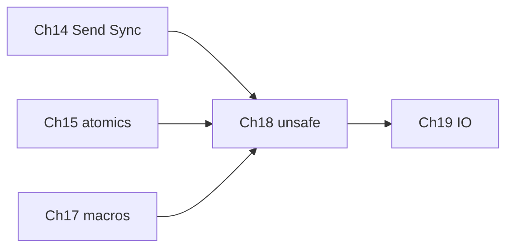

# Chapter 18: Unsafe and When to Stop

## Hook

Every ecosystem has escape hatches for performance or FFI — **Java** `sun.misc.Unsafe`, **Python** C extensions, Rust **`unsafe` blocks**. Rust keeps the same power in **`unsafe` blocks** — but the **borrow checker is off inside**, and you must uphold invariants the compiler cannot verify.

## Scope — a brief tour, not the whole nomicon

`unsafe` Rust is a large topic. This chapter is a practical intro — enough to read library internals, wrap a C SDK sketch, and know when to stop. It is not a guide to custom allocators, formal memory models, or authoring proc macros that emit `unsafe impl`. Use **Afterparty** prompts and **Go deeper** for invariant lists, JNI vs FFI, and gateway capstone designs.

| This chapter covers | Deferred to See also / Afterparty |
|---------------------|-----------------------------------|
| Four powers of `unsafe` + **why it exists** | Full [Rustonomicon](https://doc.rust-lang.org/nomicon/) |
| **Soundness** vs **safety** | Custom allocators, `Pin` / `Unpin` formalism |
| Safe wrappers over raw pointers | Lock-free data structures ([Chapter 15](15_atomics_and_lockfree.md)) |
| `unsafe fn`, `unsafe trait`, `Send`/`Sync` proof sketch | Writing proc macros with `unsafe` traits ([Chapter 17](17_metaprogramming.md)) |
| FFI orientation + checklist | Full `bindgen` / `cxx` walkthrough |
| When **not** to use `unsafe` + Miri intro | Miri deep dives, fuzzing proc macros |

This chapter builds on [Chapter 14](14_multithreading.md) (`Send`/`Sync`), [Chapter 15](15_atomics_and_lockfree.md) (`static mut` races), [Chapter 17](17_metaprogramming.md) (ecosystem `unsafe impl`), and points forward to [Chapter 19](19_io_processes_bits.md):



## Why `unsafe` exists — the aim

Rust’s default contract: **if your code compiles and uses only safe Rust, it cannot cause undefined behavior (UB).** That promise is **soundness**. `unsafe` is how the language implements that promise under the hood — and how **you** opt in when the compiler cannot see the full story.

| Role | Plain language |
|------|----------------|
| **Implement safe std** | `Vec::push`, `str`, `Box` — internally use `unsafe` so **your** call sites stay safe |
| **FFI / C ABI** | Call vendor PLC drivers, `libc`, OS APIs — memory layout and ownership cross a boundary |
| **Certify invariants** | `unsafe impl Send` for a thread-safe file descriptor wrapper the compiler cannot prove |
| **Rare performance** | After **profiling**, sometimes a hot path needs intrinsics or hand-tuned memory — last resort |

| Language | Escape hatch | Who certifies safety? |
|----------|--------------|------------------------|
| **Java** | `sun.misc.Unsafe`, JNI | JVM spec + you at JNI boundary |
| **Python** | C extension modules | Extension author; CPython users trust maintainers |
| **Rust** | `unsafe` blocks / fns / traits | **You** document invariants; safe API must still be **sound** |

**Key idea:** `unsafe` does **not** turn off all rules. Safe functions that call `unsafe` must still uphold Rust’s global soundness — callers of your safe `open_port()` must never get UB from correct use.

## What `unsafe` allows

Four operations only possible inside `unsafe` (or in an `unsafe fn` body):

| Power | Rust | Typical Java / Python parallel |
|-------|------|--------------------------------|
| Dereference raw pointers | `*const T`, `*mut T` | JNI pointers; `ctypes` address |
| Call `unsafe fn` | `Vec` growth, `from_raw_parts` | Native method calls |
| `unsafe impl` trait | `Send` / `Sync` for custom handles | `@GuardedBy` — manual proof |
| Mutable `static` | global state (avoid in app code) | `static` fields; module-level globals |

Safe Rust **around** `unsafe` must still be **sound**: a safe public API must not let callers trigger UB through normal use.

### Soundness vs safety

| Term | Meaning |
|------|---------|
| **Safety** | No `unsafe` in *this* function body — compiler enforces borrow rules |
| **Soundness** | *Entire program* cannot UB if only safe APIs are used — includes your `unsafe` invariants |

A **safe** wrapper can still be **unsound** if its `unsafe` block is wrong:

```rust
// Playground — unsound safe API (do not ship)
fn always_five() -> i32 {
    let x = 5;
    let p = &x as *const i32;
    unsafe { *p } // safe fn, but...
    // x dropped here — p would dangle if we returned *p
}

fn main() {
    println!("{}", always_five()); // OK today only because we copy before drop
}
```

**What happened:** compiles because we **copy** `*p` before `x` is dropped. Returning `&i32` or storing `p` past `x`’s lifetime would be UB — the safe signature would lie. Sound wrappers **narrow** `unsafe` to a proof you document.

## Examples: elementary → hard

Work through in order. After each snippet: **run it**, then read **what happened**.

### Level 1 — Elementary: deref a stack pointer

```rust
// Playground
fn main() {
    let n = 5;
    let p = &n as *const i32;
    unsafe {
        println!("{}", *p);
    }
}
```

**What happened:**

- `&n as *const i32` **coerces** a valid borrow to a raw pointer — no allocation change.
- **`unsafe` block** is required to **dereference** `p`; outside the block, `*p` is forbidden.
- `n` is still alive on the stack; `*p` reads `5`. The borrow checker is **off inside** the block — you must ensure `n` outlives the deref.

### Level 2 — Elementary: viewing bytes + dangling trap

Safe pattern: slice from **valid** `&[u8]` — no `unsafe` needed for everyday buffer work:

```rust
// Playground
fn as_hex_preview(buf: &[u8], max: usize) -> String {
    let take = buf.len().min(max);
    buf[..take]
        .iter()
        .map(|b| format!("{b:02x}"))
        .collect::<Vec<_>>()
        .join(" ")
}

fn main() {
    let frame = [0x01, 0x03, 0x00, 0x10, 0xFF];
    println!("{}", as_hex_preview(&frame, 3));
}
```

**What happened:** prints **`01 03 00`** — Modbus-style frames are handled with **safe slices** most of the time.

When `unsafe` appears: `slice::from_raw_parts(ptr, len)` — **your** invariants must guarantee `ptr` is valid for `len` bytes:

```rust
// Playground — conceptual; invariants listed in comments
use std::slice;

/// INVARIANTS caller must ensure:
/// 1. ptr is non-null and aligned for u8
/// 2. ptr..ptr+len is initialized and readable
/// 3. no mutable alias to same memory while &slice lives
/// 4. len does not exceed allocation
/// 5. memory outlives returned slice (or copy out)
unsafe fn view_bytes(ptr: *const u8, len: usize) -> &'static [u8] {
    slice::from_raw_parts(ptr, len)
}

fn main() {
    let data = [10u8, 20, 30];
    let p = data.as_ptr();
    let s = unsafe { view_bytes(p, 3) };
    println!("{:?}", s);
}
```

**What happened:** works here because `data` is stack-allocated and lives for `'static` in this toy — **misleading** `-> &'static` in real code. Production wrappers return `&[u8]` tied to an **owner** lifetime, or **copy** into `Vec`.

**Wrong (UB — do not run):** use `p` after `data` is dropped → dangling deref. Afterparty drills invariant lists.

### Level 3 — Intermediate: `unsafe fn` in a small module

Encapsulate `unsafe` in the **smallest** module; expose only safe constructors:

```rust
// Playground
mod ring {
    pub struct RingBuf {
        data: Vec<u8>,
        len: usize,
    }

    impl RingBuf {
        pub fn new(cap: usize) -> Self {
            Self { data: vec![0; cap], len: 0 }
        }

        /// INVARIANT: len <= data.len()
        pub unsafe fn set_len_unchecked(&mut self, len: usize) {
            self.len = len;
        }

        pub fn push_byte(&mut self, b: u8) -> bool {
            if self.len >= self.data.len() {
                return false;
            }
            self.data[self.len] = b;
            // Safe because we just wrote index `len` and len < cap
            unsafe { self.set_len_unchecked(self.len + 1) };
            true
        }

        pub fn as_slice(&self) -> &[u8] {
            &self.data[..self.len]
        }
    }
}

fn main() {
    let mut rb = ring::RingBuf::new(4);
    rb.push_byte(0xAA);
    rb.push_byte(0xBB);
    println!("{:02x?}", rb.as_slice());
}
```

**What happened:** prints **`[170, 187]`** (`0xAA`, `0xBB`). `set_len_unchecked` is `unsafe` because a wrong `len` would make `as_slice()` read **uninitialized** or **out-of-bounds** memory — same idea as `Vec`’s internal length updates.

### Level 4 — Hard: `unsafe impl Send` for an opaque handle

[Chapter 14](14_multithreading.md): types moved into `thread::spawn` must be **`Send`**. Raw pointers are not `Send`; OS handles sometimes need a **manual proof**:

```rust
// Playground
use std::sync::Arc;
use std::thread;

/// Wraps a fictional OS file descriptor (i32).
/// PROOF for Send: fd is owned, close-on-drop only on owning thread,
/// and we never share &mut access — only Arc move into one thread at a time.
struct SerialHandle {
    fd: i32,
}

unsafe impl Send for SerialHandle {}

impl SerialHandle {
    fn open_fake() -> Self {
        Self { fd: 3 }
    }
    fn read_line(&self) -> String {
        format!("fd={} ok", self.fd)
    }
}

fn main() {
    let h = Arc::new(SerialHandle::open_fake());
    let h2 = Arc::clone(&h);
    let t = thread::spawn(move || h2.read_line());
    println!("main: {}", h.read_line());
    println!("thread: {}", t.join().unwrap());
}
```

**What happened:** both threads print **`fd=3 ok`**. Without `unsafe impl Send`, `thread::spawn(move || h2...)` would **not compile**. Production code often uses crates like `serialport` (safe API, `unsafe` inside) so you rarely write this — but you may **read** it in driver wrappers.

`Sync` is a separate proof (sharing `&T` across threads) — often `Arc<Mutex<...>>` instead of hand-rolled `unsafe impl Sync`.

### Level 5 — Hard: FFI sketch (Cargo only)

Calling C from Rust — needs `libc`, link flags, and ABI discipline:

```rust
// Cargo only — conceptual; needs libc in Cargo.toml
// use std::ffi::{CStr, CString};
// use std::os::raw::c_char;
//
// extern "C" {
//     fn strlen(s: *const c_char) -> usize;
// }
//
// fn main() -> Result<(), Box<dyn std::error::Error>> {
//     let msg = CString::new("PING")?;
//     let len = unsafe { strlen(msg.as_ptr()) };
//     println!("C strlen = {len}");
//     Ok(())
// }
```

**What happened (conceptually):** `CString` owns a nul-terminated buffer; `as_ptr()` borrows it for the call. **`unsafe`** because C may read arbitrary memory if invariants fail. Never call after `drop(msg)`; mind **who frees** (Rust owns `CString`; C must not `free` it unless documented).

| Tool | When |
|------|------|
| **`bindgen`** | Generate `extern "C"` from `.h` |
| **`cxx`** | Safe-ish C++ interop bridge |
| **`libc`** | Common C types and functions |

## Practical cases in services and embedded

| Situation | Typical approach |
|-----------|------------------|
| Serial / GPIO / async I/O | Use **`serialport`**, **`tokio`**, **`rppal`** — safe API, `unsafe` inside crate |
| Parse JSON/TOML config | **`serde`** — no hand-written pointer tricks |
| Vendor C PLC SDK | Thin safe Rust module; `extern "C"` + ownership docs; or ask for Rust bindings |
| Shared-memory ring buffer | `unsafe` + atomics ([Chapter 15](15_atomics_and_lockfree.md)); Miri + tests |
| “Speed up JSON” | Profile → better algorithm → **`simd-json`** / `serde` features → `unsafe` last |

**Decision flow:**

```
Need C library or OS API?
  ├─ no  → stay in safe Rust
  └─ yes → safe wrapper crate exists?
         ├─ yes → use crate (preferred)
         └─ no  → bindgen/cxx + checklist below
Hot path slow?
  ├─ profile first
  ├─ algorithm / batching / fewer allocations
  └─ then SIMD crate or expert-reviewed unsafe
```

**CRC / Modbus example:** prefer Rust `crc` crate or pure-Rust protocol code over pasting C `unsafe` unless the C library is **required** by hardware vendor and already audited.

## `unsafe fn` and `unsafe trait`

- **`unsafe fn`:** caller must uphold preconditions (e.g. `set_len_unchecked`). Mark the **contract** in doc comments.
- **`unsafe trait`:** `Send`, `Sync` — implementing asserts thread-safety the compiler cannot derive.
- **Std library:** `Vec::push`, `String::from_utf8_unchecked` (in std internals) — pattern: **unsafe inside, safe outside**.

Ecosystem [Chapter 17](17_metaprogramming.md) derives may emit `unsafe impl` in generated code — application authors rarely write those by hand.

## FFI — checklist and pitfalls

| Step | Check |
|------|--------|
| ABI | `extern "C"` unless docs say otherwise |
| Strings | `CString` / `CStr`; nul-terminated; encoding (UTF-8 vs locale) |
| Ownership | Who allocates? Who frees? Same allocator? |
| Pointers | Valid for entire call; not dangling after Rust `drop` |
| Panics | Unwinding across C is UB — `panic=abort` or `catch_unwind` at boundary |
| Threads | Is the C API thread-safe? Match with `Send`/`Sync` proofs |
| Errors | `errno` vs return codes — map to `Result` in safe wrapper |

**Java JNI parallel:** local/global refs, exception checking, and “who owns the buffer” mirror Rust’s pointer + lifetime discipline — Rust catches more at compile time in safe code, but **FFI is still manual proof**.

## Miri — when to run it

**Miri** is an interpreter that detects undefined behavior in unsafe code (use-after-free, aliasing violations, etc.).

```bash
rustup +nightly component add miri
cargo +nightly miri test
```

| When | Why |
|------|-----|
| After adding/changing `unsafe` | Catch UB tests miss |
| Before merging FFI wrapper PR | Cheap extra audit |
| Teaching / learning | See *why* a pattern is wrong |

Miri does not replace code review or fuzzing — it complements them. See Afterparty for drill prompts.

## When **not** to use `unsafe`

| Bad reason | Better move |
|------------|-------------|
| “Borrow checker annoys me” | Restructure ownership ([Chapter 5](05_lifetimes.md)), `Arc`/`Mutex` ([Chapter 14](14_multithreading.md)) |
| “Faster without measuring” | `cargo bench`, flamegraph, fewer allocations |
| “Avoid learning lifetimes” | Fix API shape; unsound shortcuts break production |
| “Replace `Mutex` with raw pointers” | Data races → UB; use atomics or channels ([Chapter 15](15_atomics_and_lockfree.md)) |

Most application code **never** needs `unsafe` in *your* crate — depend on maintained libraries instead.

## Edge cases and compiler traps

| Trap | Symptom | Idiom |
|------|---------|-------|
| Dangling raw pointer | UB, Miri failure | Tie pointer to owner lifetime; copy if needed |
| `from_raw_parts` wrong `len` | read past buffer | Assert `len <= cap`; test boundary |
| Two `*mut` aliases + write | UB (stacked borrows) | `Mutex`, single owner, or proven uniqueness |
| `static mut` + threads | data race UB | `Atomic*` or `Mutex` ([Chapter 15](15_atomics_and_lockfree.md)) |
| Unwinding into C | UB | `panic=abort` or no panic across FFI |
| “Safe” API returns dangling ref | unsound library | code review + Miri |

## Idiom spotlight

> **Encapsulate `unsafe` in the smallest module; document invariants in comments; test aggressively.** Prefer safe crates maintained by experts for FFI.
>
> **Profile before `unsafe` for speed.** A safe algorithm beat beats a wrong `unsafe` patch.
>
> **Safe wrapper, documented proof:** every `unsafe` block should name what safe callers rely on.

## Go deeper

- [Rustonomicon](https://doc.rust-lang.org/nomicon/) — ownership, FFI, unwinding
- [Miri](https://github.com/rust-lang/miri) — UB detection
- [Procedural macro intro](https://hightechmind.io/rust/) — 423 (boundary with unsafe traits)

## See also

- [Chapter 1: Paradigm shift](01_paradigm_shift.md) — raw pointers vs references
- [Chapter 8: Errors and testing](08_errors_and_testing.md) — no `panic` across unattended service boundaries
- [Chapter 14: Multithreading](14_multithreading.md) — `Send` / `Sync`
- [Chapter 15: Atomics](15_atomics_and_lockfree.md) — `static mut` vs atomics
- [Chapter 17: Metaprogramming](17_metaprogramming.md) — derive-generated `unsafe impl`
- [Chapter 19: I/O](19_io_processes_bits.md) — `Read`/`Write`, processes, binary frames

### Afterparty: AI Lego blocks

Copy a prompt into your AI tutor. Insist on **compiler-accurate** answers — quote UB vs compile errors, show fixed code, and say *why*.

#### Why unsafe and soundness

1. **Invariant list** — “For raw pointer to buffer + length, list 5 invariants a safe wrapper must enforce.”
2. **Soundness** — “Explain ‘safe Rust can’t cause UB’ vs `unsafe` — one paragraph; include unsound safe wrapper example.”
3. **Scope honesty** — “List 6 topics Ch18 skips and where to learn each (nomicon, Miri, Pin, …).”
4. **Aim table** — “Fill: why Vec needs `unsafe` internally while `push` stays safe for callers.”
5. **Promise diagram** — “Draw safe API → unsafe block → invariants → caller cannot UB; label soundness.”

#### Raw pointers and safe wrappers

6. **`*const` vs `&T` quiz** — “Give 5 snippets: legal ref, needs `unsafe` block, compile error; I classify each.”
7. **from_raw_parts design** — “Design `fn view_frame(ptr, len) -> Result<&[u8], Error>` without `&'static`; list invariants.”
8. **Dangling audit** — “Show stack pointer used after drop; I explain UB; you show Miri-style symptom.”
9. **Modbus buffer** — “Register table as `&[u8]` vs `from_raw_parts` — when is each idiomatic in a gateway?”
10. **Hex preview port** — “Port Level 2 `as_hex_preview` to return `Result` on empty buffer; no `unwrap`.”

#### `unsafe fn`, `Send`, and `Sync`

11. **set_len contract** — “Document pre/post conditions for `set_len_unchecked`; what breaks `as_slice` if violated?”
12. **Send proof** — “I claim `Rc<*mut u8>` is Send; you disprove with compiler error quote.”
13. **SerialHandle Sync** — “When would `SerialHandle` need `unsafe impl Sync` vs `Arc<Mutex<...>>`? Two sentences each.”
14. **Ch14 port** — “Rewrite Level 4 spawn example using only safe types — when is it impossible?”
15. **Proc-macro boundary** — “Why do serde/tokio crates use `unsafe impl` you don’t write? Link Ch17.”

#### FFI and automation

16. **FFI checklist** — “Checklist for calling a C Modbus library from a Rust binary; include panic and ownership rows.”
17. **CString trap** — “Show `into_raw` forgotten `from_raw` leak; fix with RAII pattern sketch.”
18. **Vendor SDK** — “Diagram ownership: Rust owns config, C owns connection, callback pointer — boxes and arrows only.”
19. **serialport hide** — “Where does `unsafe` live in a typical serial crate vs my application code?”
20. **CRC decision** — “C `crc16` vs Rust `crc` crate vs hand-rolled — decision tree for production gateway.”
21. **Java JNI** — “Compare JNI pitfalls (refs, exceptions, pinning) to Rust FFI ownership rules.”

#### Miri, testing, and review

22. **Miri** — “What is Miri and when should I run it relative to `unsafe` changes? Include one command.”
23. **Trap quiz** — “Mark 6 snippets: safe, UB, ordering bug, needs Miri, needs Mutex, unsound safe API.”
24. **Review rubric** — “10-point code-review checklist for an `unsafe` PR in an automation repo.”
25. **Test plan** — “Unit + Miri + integration tests for new `extern 'C'` wrapper — bullet list only.”

#### When not to use unsafe

26. **Avoid** — “Review use case: speed up JSON — `unsafe` vs `simd-json` vs algorithm; pick with justification.”
27. **Borrow checker fight** — “I paste fight-the-borrow-checker code; you refactor to safe Rust without `unsafe`.”
28. **static mut** — “Compare `static mut` counter vs `AtomicUsize` from Ch15 — UB vs defined behavior.”

#### Capstone

29. **PlcDriver API** — “Design safe `PlcDriver` Rust API over fictional `extern 'C'` — types, `Result`, no raw pointers in public API.”
30. **Level ladder recap** — “Explain Levels 1–5 in one paragraph each for a Java teammate who knows JNI.”
