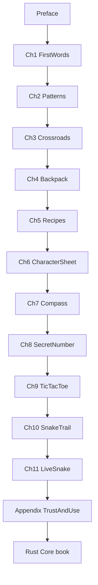

# Table of Contents

**Rust from the Scratch** — Part of [Vibe Learning](../README.md). Zero experience → small games → local Snake.

---

## Preface

| Doc | File |
|-----|------|
| [Preface](chapters/preface.md) | `chapters/preface.md` |

## Part I — First programs

| Ch | Title | File |
|----|-------|------|
| 1 | [First Words](chapters/01_first_words.md) | `chapters/01_first_words.md` |
| 2 | [Patterns on the Wall](chapters/02_patterns_on_the_wall.md) | `chapters/02_patterns_on_the_wall.md` |

## Part II — Building blocks

| Ch | Title | File |
|----|-------|------|
| 3 | [Crossroads](chapters/03_crossroads.md) | `chapters/03_crossroads.md` |
| 4 | [The Backpack](chapters/04_the_backpack.md) | `chapters/04_the_backpack.md` |
| 5 | [Recipes](chapters/05_recipes.md) | `chapters/05_recipes.md` |
| 6 | [Character Sheet](chapters/06_character_sheet.md) | `chapters/06_character_sheet.md` |

## Part III — Game novels

| Ch | Title | File |
|----|-------|------|
| 7 | [Compass and Doors](chapters/07_compass_and_doors.md) | `chapters/07_compass_and_doors.md` |
| 8 | [Guess the Secret](chapters/08_guess_the_secret.md) | `chapters/08_guess_the_secret.md` |
| 9 | [Tic-Tac-Toe Arena](chapters/09_tic_tac_toe_arena.md) | `chapters/09_tic_tac_toe_arena.md` |
| 10 | [Snake Trail](chapters/10_snake_trail.md) | `chapters/10_snake_trail.md` |

## Part IV — Your machine

| Ch | Title | File |
|----|-------|------|
| 11 | [Live on Your Machine](chapters/11_live_on_your_machine.md) | `chapters/11_live_on_your_machine.md` |

## Appendices

| Doc | Purpose |
|-----|---------|
| [Playground Guide](appendix/PLAYGROUND_GUIDE.md) | Run snippets online vs locally |
| [Trust & Use](appendix/TRUST_AND_USE.md) | Deferred syntax explained |

---

## Suggested pace

| Part | Chapters | Rough time |
|------|----------|------------|
| I | Preface + 1–2 | 5–6 h |
| II | 3–6 | 10–12 h |
| III | 7–10 | 10–12 h |
| IV | 11 | 2–3 h |

Adjust for your speed. Replay a chapter if a game idea clicks late — that is normal.

---

## Side quests (not in this edition)

Ideas for later chapters or self-study after you finish:

- Hangman with ASCII gallows
- Connect Four on a text board
- Text-mode Space Invaders

These reuse the same tools you learn in Chapters 7–10. When you are ready for ownership and modules, see **[Rust Core](../rust-core/CONTENTS.md)**.

---

## Reading order (mermaid)

